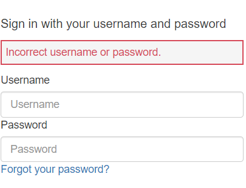
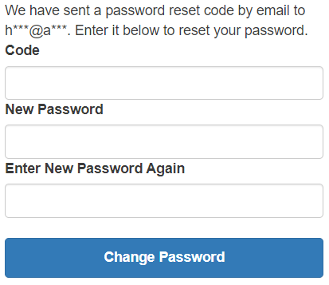

# Accesso

### 1 Portale&#x20;

[https://lookinglass.ipagency.it&#x20;

\
](https://lookinglass.ipagency.it)Cliccando su questo link si verrà reindirizzati alla pagina d'accesso di Lookinglass.&#x20;

### 2 Login

<figure><figcaption>
immagine 1
</figcaption></figure>

Una volta che la pagina sarà completamente carica vi ritroverete un riquadro  come l'immagine 1, andrà compilato con le vostre credenziali, le quali vi sono precedentemente inviate via e-mail (come d'accordo con IPA), dopo di che vi basterà premere su Sign in.

### 3 Problematiche di login

Durante il login si possono verificare 2 scenari principali, il primo legato ad un errore prettamente umano, il secondo dato da sistema:

\-errore umano:

l'errore umano è dato dall'inserimento scorretto dei dati da parte dell'utente, come l'inserimento della password o dell'username errati come nell'immagine 2.

<figure><figcaption>
immagine 2
</figcaption></figure>

Questo avviene quando l'utente non si ricorda le sue credenziali, per risolvere tale problema vi basterà recuperare l'e-mail inviata da lookinglass-help@ipagency.it con le vostre credenziali al suo interno.\
Nel caso abbiate modificato la password d'accesso e quindi non è la stessa nell'email, vi basterà cliccare _**Forgot your password?**_ si aprirà un nuovo riquadro come nell'immagine 3.

<figure><figcaption>
immagine 3
</figcaption></figure>

Qui dovrete inserire il vostro username, nell'immediato vi verrà mandato un codice via e-mail si aprirà una nuova pagina come nell'immagine 4.

<figure><figcaption>
immagine 4
</figcaption></figure>

Inserite il codice pervenuto precedentemente via e-mail nel riquadro sotto **Code** e infine inserite la nuova password e ripetetela una seconda volta, così otterrete la password per l'accesso a Lookinglass.\
Nel caso non abbiate ricevuto l'email controllate nello spam.

\-l'errore da sistema:

avviene quando si hanno delle criticità interne che posso sfociare in un disservizio, come una possibile interruzione o non raggiungibilità della pagina, in questo caso basterà scrivere all'email: lookinglass-help@ipagency.it .

