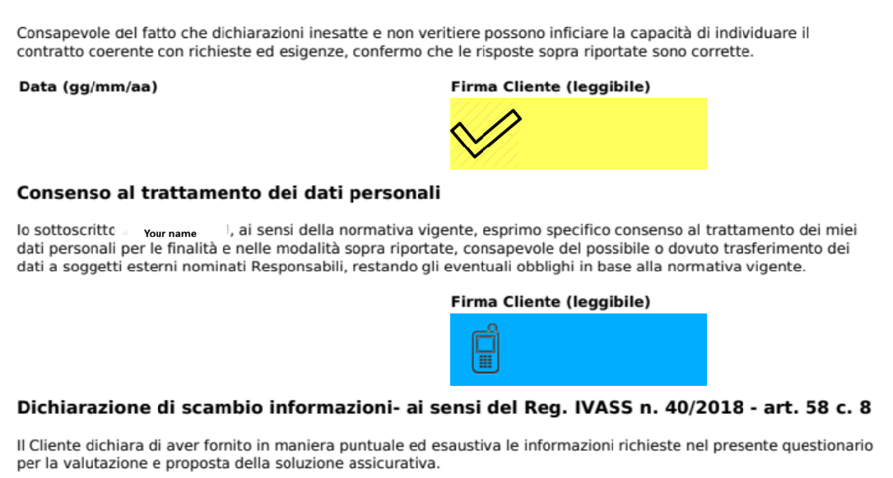

# AML / LCB-FT Screening & Gestione Segnalazioni

Il modulo **Segnalazioni AML** in Lookinglass permette agli intermediari di visualizzare i risultati degli screening AML, verificare eventuali match, e gestire le decisioni direttamente all’interno della piattaforma.

***

### Rapporti di screening AML

\
**Report di Screening AML**

Ogni volta che un controllo AML viene effettuato dal provider esterno, Lookinglass genera un report raggruppato che riassume tutti i clienti analizzati.

I report sono accessibili da:

**Menu → Segnalazioni AML**

\

*

    <figure><figcaption></figcaption></figure>

### Notifiche via e-mail

Quando viene rilevato un potenziale match, gli intermediari ricevono automaticamente un’email di allerta AML.

L’email contiene:

* Nome del cliente
* Numero dei termini corrispondenti
* Link alla segnalazione AML sul portale esterno
* Link al report AML in Lookinglass
* Link alla pagina pubblica di ComplyAdvantage

***

### Visualizzazione del rapporto AML

Il sistema visualizza tutti i clienti in un unico report raggruppato per facilitarne la consultazione.\
\
Da qui, gli intermediari possono navigare rapidamente verso:

* Scheda anagrafica del cliente
* Elenco dei submitted terms
* Link esterni di riferimento AML

***

### Dati anagrafici del cliente (codice fiscale)

Cliccando sul codice fiscale si accede alla pagina anagrafica del cliente.\
Questa pagina include:

* Dati personali completi
* Paese di nascita
* Agenzia/intermediario responsabile
* Documenti caricati

***

### Avviso AML  (link ID)

\
Il link "ID" apre il caso AML sul portale AML WAKAM.\
Questa pagina consente agli intermediari di confermare o chiudere gli avvisi direttamente con WAKAM.

***

### Riferimento ComplyAdvantage (link al termine inviato)

Ogni termine inviato include un link diretto al rapporto pubblico di ComplyAdvantage.\
Questo aiuta a verificare se la persona corrispondente corrisponde effettivamente al cliente.

* Alias
* Paese associato
* Ruoli politici
* Motivo del match
* Livello di rischio

Su ComplyAdvantage è possibile controllare:

\
\
.png>).png>)

***

### **Segnalazioni AML (AML Claims) in Lookinglass**

Per ogni cliente con un match AML viene generata automaticamente **una singola Segnalazione AML (AML Claim)**.

Questa area permette di:

* Esaminare i dettagli del match
* Aggiungere note interne
* Consultare i riferimenti ComplyAdvantage
* Aggiornare lo stato della segnalazione

La segnalazione include:

* Nome cliente e codice fiscale
* Paese di nascita
* ID risposta&#x20;
* Tutti i submitted terms
* Riferimenti ComplyAdvantage
* Note interne
* Stati della segnalazione (Aperto, Falso Positivo, Chiuso)

Il sistema salva in automatico la **storia degli stati**.

Una segnalazione può essere chiusa solo quando **entrambi**:

* `state`
* `state_company`

sono impostati sullo stesso valore finale (Chiuso o Falso Positivo). 

<figure><figcaption></figcaption></figure>

Altrimenti appare l’avviso:

> **“Si può chiudere o falso positivo solo se chiuso e falso positivo anche sulla compagnia.”**

***

### Processo di revisione AML  (flusso intermedio)

Il flusso operativo tipico è il seguente:

* Aprire l’email di alert AML e seguire i link
* Consultare il report AML del cliente in Lookinglass
* Aprire la Segnalazione AML (AML Claim) relativa
* Verificare l’alert sul portale WAKAM
* Controllare la scheda anagrafica del cliente
* Rivedere le informazioni di polizza e i documenti
* Utilizzare il link a ComplyAdvantage per validare il match
* Aggiungere note interne
* Impostare la segnalazione come **Falso Positivo** o **Chiuso**, in base all’esito
* Impostare lo stesso stato anche su **state\_company**
* Aggiornare la pagina di alert AML sul portale WAKAM

Questo flusso sostituisce la vecchia procedura manuale:

> _“cerca in anagrafica → cerca nelle polizze → cerca su WAKAM → cerca su ComplyAdvantage”_

e centralizza tutto in un’unica segnalazione in Lookinglass.
