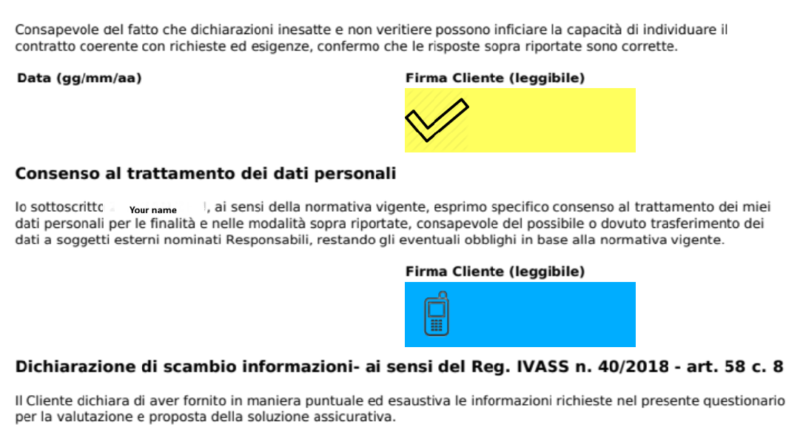

# Come firmare un documento (piattaforma IDSign)

### 1️. Avvia il processo

Quando apri il link di firma inviato via e-mail, verrà caricata la piattaforma IDSign.

* Clicca **INIZIA OTP** per iniziare.
* Il sistema invierà una password monouso (OTP) tramite SMS al numero di cellulare registrato durante.

<figure><figcaption></figcaption></figure>

### 2. Inserisci il codice OTP

Passaggi:

1. Inserisci il codice OTP ricevuto tramite SMS.
2. Clicca **CONFERMA**
3. Se non ricevi l'OTP, clicca nuovamente su "Invia OTP".

### 3. Accedi alla pagina delle firme

Dopo aver inserito l'OTP corretto, vedrai:

* Anteprima del documento
* Frecce di navigazione (per spostarsi tra le pagine)
* Il **“INIZIA FIRMA”** pulsante (Avvia firma)

Clicca **INIZIA FIRMA** per iniziare.

<figure><figcaption></figcaption></figure>

### 4. Rivedere il documento

Prima di firmare, puoi:

* Scorri il documento
* Utilizza le frecce di navigazione per spostarti tra le pagine
* Ingrandisci/riduci se necessario
* Sezioni di revisione quali:
  * Consenso alla privacy
  * Dichiarazioni IVASS
  * Trattamento dei dati personali
  * Questionario di adeguatezza

Assicurati che tutte le informazioni siano corrette prima di procedere.

### 5. Seleziona campi firma

Durante la navigazione nel documento, vedrai evidenziate le aree della firma. (“Firma Cliente (leggibile)”).

Quando raggiungi un campo firma:

* Clicca sull'area della firma
* Il sistema lo contrassegna come selezionato

<figure><figcaption></figcaption></figure>

### 6. Rivedi le firme selezionate(Riepilogo Firme)

Una volta selezionati tutti i campi obbligatori, viene visualizzata una finestra di riepilogo:

“RIEPILOGO FIRME”

Questa finestra mostra:

* Le pagine in cui è richiesta la firma
* Le sezioni selezionate per la firma

Clicca **CONFERMA** per continuare.

<figure><figcaption></figcaption></figure>

### 7. Inserisci il codice OTP

Viene visualizzata una nuova schermata:

1. Inserisci il codice OTP ricevuto tramite SMS.
2. Se non l'hai ricevuto, clicca su:
   * **“invia un altro OTP”**
3. Clicca **CONFERMA**

.png>)

### 8. Completamento della firma

* Il documento è firmato digitalmente.
* Sul documento compare un sigillo con firma digitale.
* Clicca SIGILLA per completare il processo

La firma è legalmente valida e conforme alle normative sulle firme elettroniche.

<figure><figcaption></figcaption></figure>

###
