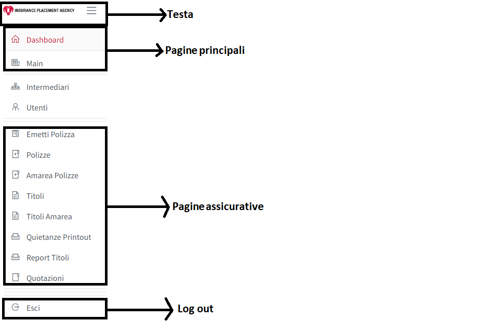
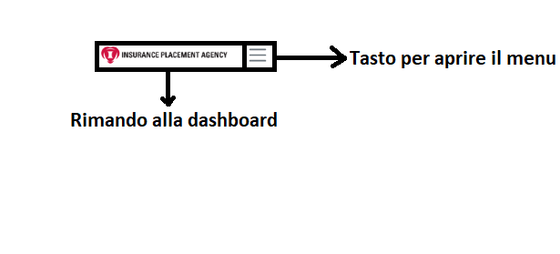
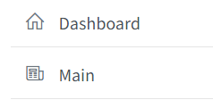
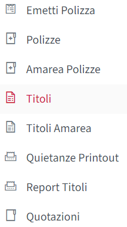
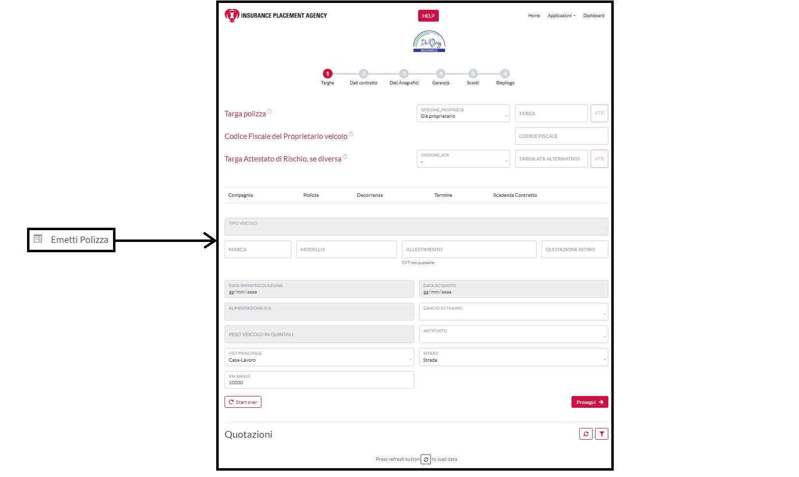
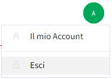
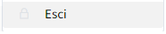
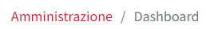
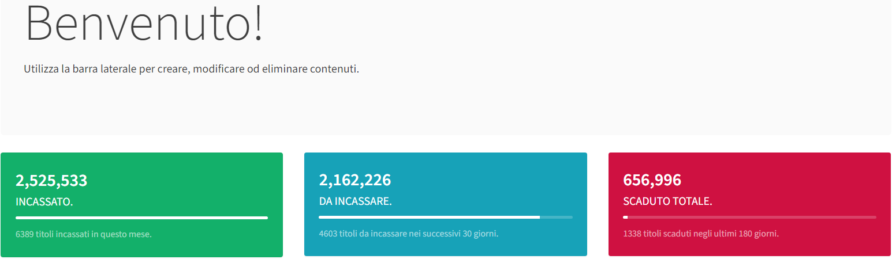

# Dashboard

La **Dashboard** è il menu principale dove l'intermediario avrà modo di usufruire la piattaforma **Lookinglass** a 360°.\
All'interno della della **Dashboard** l'utente potrà visionare le proprie credenziali, effettuare e controllare l'operazioni assicurative.

### 1 Struttura&#x20;

<figure><figcaption>
immagine 3.1
</figcaption></figure>

Possiamo divide la **Dashboard** in 5 macro per il ruolo che ricoprono, che sono:&#x20;

1. Menu;
2. Tasto assistenza, già affrontato nel capitolo precedente;
3. Info Utente;
4. Percorso;
5. Panoramica.

### 1.1 Menu

&#x20;

<figure><figcaption>
immagine 3.2
</figcaption></figure>

Nel **Menu** è possibile trovare tutti portali di cui l'utente ha bisogno per poter svolgere le proprie operazioni assicurative.\
Il **Menu** è composto da 4 parti principali, che sono:&#x20;

1. **Testa**
2. **Pagine principali**
3. **Pagine assicurative**
4. **Log out**

#### 1.1.1 Testa

<figure><figcaption>
immagine 3.3
</figcaption></figure>

Qui possiamo ritrovare il logo IPA, che se cliccato ci riporterà sempre alla **Dashboard**, di fianco c'è una miniatura a forma di tendina che se cliccata permette l'apertura o la chiusura del **Menu**.

#### 1.1.2 Pagini principali&#x20;

<figure><figcaption>
immagine 3.4
</figcaption></figure>

Le **Pagini principali** sono le pagini informative e formative che danno gli strumenti all'utente per il corretto utilizzo di **Lookinglass**

#### 1.1.3 Pagine assicurative

<figure><figcaption>
immagine 3.5
</figcaption></figure>

Le **Pagine assicurative** sono l'insieme di tutte quelle pagine che permetto all'intermediario di svolgere il proprio lavoro sulla piattaforme, come vedere i propri titoli oppure creare nuove polizze o visionare quelle già fatte. Di seguito troverete dell'immagini illustrative che vi permetteranno di vedere la corrispondenza diretta che c'è tra voce nel menu e la pagina a cui si è indirizzati.

<figure><figcaption>
immagine 3.6
</figcaption></figure>

<figure><figcaption>
immagine 3.7
</figcaption></figure>

<figure><figcaption>
immagine 3.8
</figcaption></figure>

<figure><figcaption>
immagine 3.9
</figcaption></figure>

<figure><figcaption>
immagine 3.10
</figcaption></figure>

<figure><figcaption>
immagine 3.11
</figcaption></figure>

#### 1.1.4 Logout/esci

<figure><figcaption>
immagine 3.12
</figcaption></figure>

Alla fine del **Menu** possiamo trovare la voce **Esci**, uno dei tanti presenti sul portale, ci permette di fare log out dalla pagina.

### 1.2 Info utente

<figure><figcaption>
immagine 3.13
</figcaption></figure>

l'**Info utente** lo trovate in alto a sinistra se cliccatovi sopra si aprirà una tendina che avrà due opzioni la prima racchiude tutte l'informazioni sul proprio Account il secondo vi permetterà di uscire da portale, come potete vedere da immagine 3.13 e 14.

<figure><figcaption>
immagine 3.14
</figcaption></figure>

<figure><figcaption>
immagine 3.15
</figcaption></figure>

### 1.3 Percorso

<figure><figcaption>
immagine 3.16
</figcaption></figure>

Il **Percorso** permette di vedere il percorso fatto all'interno della pagina e se clicatovì vi permettera di selezionare la cartella interessata all'interno del precorso.&#x20;

### 1.4 Panoramica

<figure><figcaption>
immagine 3.17
</figcaption></figure>

La **Panoramica** ha una duplice funzione, cioè quella formare il cliente attraverso l'istruzioni sotto la scritta Benvenuto!, ma anche di informare il cliente su qual è l'andamento del portale, attraverso i tre riquadri colorati in basso.

<figure><figcaption>
immagine 3.18
</figcaption></figure>

nell'immagine 3.18 possiamo vedere l'incassato del mese, sta a significare sono tutte le polizze che sono state già pagate nel mese

<figure><figcaption>
immagine 3.19
</figcaption></figure>

Nell'immagine 3.19 possiamo vedere le polizze ancora da incassare negli ultimi 30 giorni,  questo significa il pagamento delle quietanze o dei rinnovi di quest'ultime non sono ancora avvenute.

<figure><figcaption>
immagine 3.20
</figcaption></figure>

Gli scaduti totali sono i rinnovi o le quietanze non incassate a portale entro 30 giorni dalla dalla loro scadenza.
