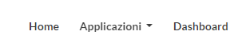
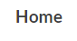
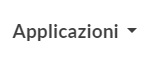
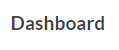
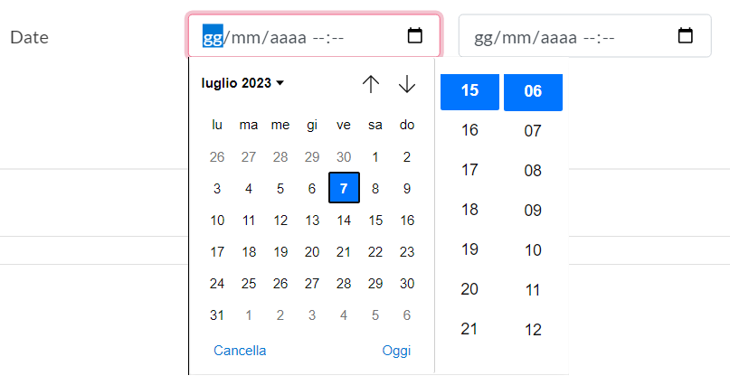
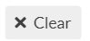

# Main

La pagina **Main** è stata creata con lo scopo di tener sempre aggiornato l'utente che utilizza Lookinglass su ciò che avviene all'interno del portale, ma non solo ha anche lo scopo di avvisare di malfunzionamenti esterni di terzi siti come ANIA. Inoltre ha anche la funzione di formare l'intermediario sul corretto utilizzo della piattaforma .

## **1 Struttura**&#x20;

<figure><figcaption>
immagine 2.1
</figcaption></figure>

La pagina **Main** è struttura come nell'immagine 2.1, cioè:

1. Logo IPA;
2. Tasto assistenza;
3. Menu;
4. Barra di scorrimento;
5. Filtro;
6. Indice;
7. Overview comunicazioni ufficiali.

### 1.1 Logo IPA

<figure><figcaption>
immagine 2.2
</figcaption></figure>

Nell'immagine 2.2 possiamo vedere il logo IPA, serve avvisare l'utente che il servizio di Lookinglass è erogato da IPA S.r.l. , ha anche la funzione di riportare alla pagina iniziale quando hai aperto un overview.

### 1.2 Tasto assistenza&#x20;

<figure><figcaption>
      immagine 2.3
</figcaption></figure>

Nell'immagine 2.3 possiamo vedere il tasto assistenza, cioè un rettangolo rosso con all'interno la scritta bianca HELP, questo pulsante serve per inviare una richiesta d'aiuto al team di supporto tecnico di Lookinglass, cliccandoci sopra vi apparirà una finestra in sovrimpressione, come nell'immagine 2.4.&#x20;

<figure><figcaption>
immagine 2.4
</figcaption></figure>

Nell'immagine 2.4 potete vedere tutti i campi da compilare prima di inviare la richiesta di supporto. \
I campi con l'asterisco vanno obbligatoriamente compilati altrimenti non permette l'invio della domanda d'aiuto. Se non si ha ben chiaro come compilare correttamente il questionario, basterà copiare ed incollare il link ( [https://www.loom.com/share/2652e8566bc14ee59c159da1b3413f74
](https://www.loom.com/share/2652e8566bc14ee59c159da1b3413f74) ) che trovare a metà del questionario sotto la dicitura tutorial su come inserire il link.\
Infine cliccate non sono un robot ed inviate la richiesta cliccando su **Submit** ed aspettate che il team d'assistenza vi risponda.&#x20;

### 1.3 Menu&#x20;

<figure><figcaption>
immagine 2.5
</figcaption></figure>

Nell'immagine 2.5 possiamo vedere il menu, vi permette di muovervi all'interno di Lookinglass e di portali affiliati a I.P.A. srl.

<figure><figcaption>
immagine 2.6
</figcaption></figure>

La scritta **Home**, presente della nella fascia di reindirizzamento pagine, permette all'usuario di ritornare sempre alla pagina iniziale ogni qual volta lo desideri.

<figure><figcaption>
immagine 2.12
</figcaption></figure>

Applicazioni contiene l'elenco applicazione disponibili per l'utente.

<figure><figcaption>
immagine 2.11
</figcaption></figure>

Dashboard contiene le funzionalità di back office di **Lookinglass**

### 1.4 Barra di scorrimento&#x20;

<figure><figcaption>
immagine 2.12
</figcaption></figure>

La barra di scorrimento permette di visionare gli **Overview** che non appiano nel immediato sulla pagina **Main**, basterà cliccare sulle freccette per far si che appaiano le news mancanti, che si possono trovare davanti o dietro agli annunci visibili. \
Mentre le doppie frecce servono per muoversi alla prima e ultima pagina d'annunci.

### 1.5 Filtro

<figure><figcaption>
immagine 2.13
</figcaption></figure>

Il filtro è uno strumento che vi  permetterà di cercare qualsiasi alert o annuncio all'interno dell'**Overview** della pagina **Main**.\
Il filtro è composto da 6 diverse parti che sono:

1. **Barra di ricerca**, vi si può inserire il titolo dell'annuncio che si sta cercando&#x20;

<figure><figcaption>
immagine 2.14
</figcaption></figure>

2. **Tags**, è il filtro che funziona coi Tag con la quale gli annunci sono stati catalogati&#x20;

<figure><figcaption>
immagine 2.15
</figcaption></figure>

3. **Compagnie**, è il filtro che ti permette di cercare le news per il nome delle compagnie

<figure><figcaption>
immagine 2.16
</figcaption></figure>

4. Date, è il filtro che ti permette cercare gli annunci tramite l'utilizzo della data di pubblicazione, basterà selezionare data e ora

<figure><figcaption>
immagine 2.17
</figcaption></figure>

2. Mostra articoli già letti, ti permette di filtrare gli articoli già letti da quelli non letti, basterà cliccare sulla levetta per non visualizzare gli articoli già visionati.

<figure><figcaption>
immagine 2.18
</figcaption></figure>

2. x Clear, ti permette di cancellare tutti i filtri applicati.

<figure><figcaption>
immagine 2.19
</figcaption></figure>

### 1.6 Indice

<figure><figcaption>
immagine 2.20
</figcaption></figure>

L'**indice** raggruppa tutte le news in delle specifiche categorie, selezionando una delle parole in esso vi compariranno tutte i comunicati legati a quella medesima categoria.

### 1.7 Overview comunicazioni ufficiali&#x20;

<figure><figcaption>
immagine 2.21
</figcaption></figure>

L'**overview** serve per mantenere sempre aggiornati i utenti di ciò che succede alla piattaforma tramite le comunicazioni al suo interno, per poter usufruire di tali informazioni basterà cliccare su titoli oppure all'interno di ogni singolo annuncio per poterlo leggere in modo integrale.&#x20;

