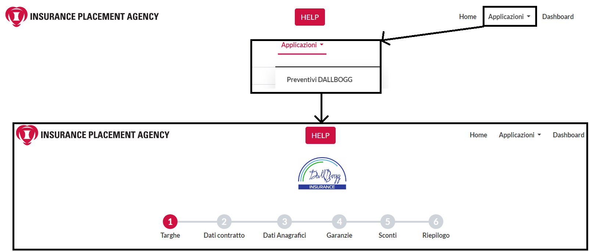
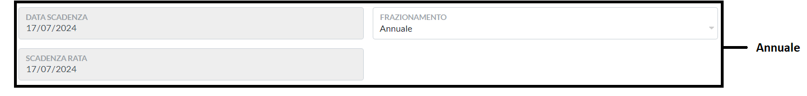
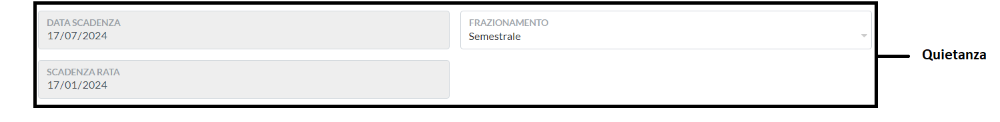
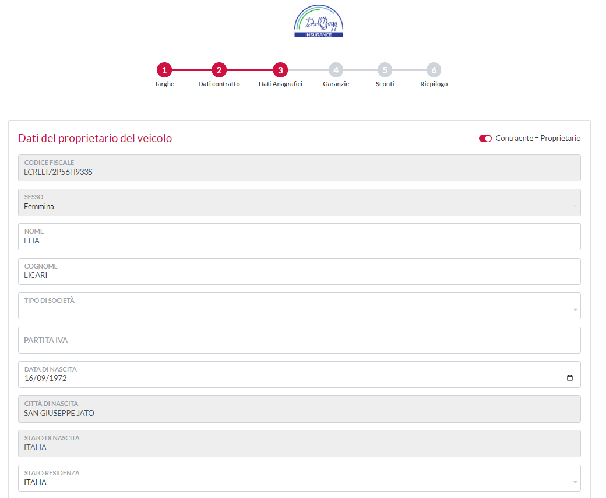
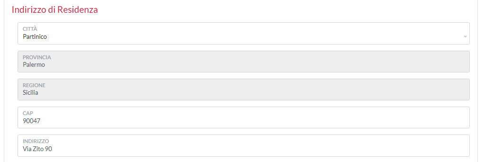
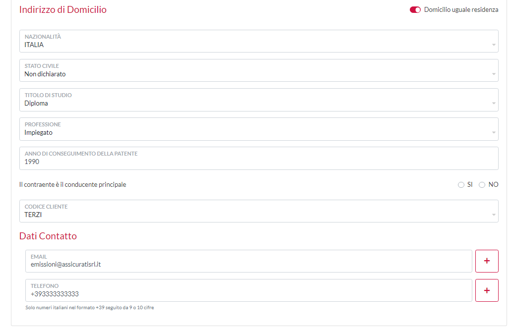
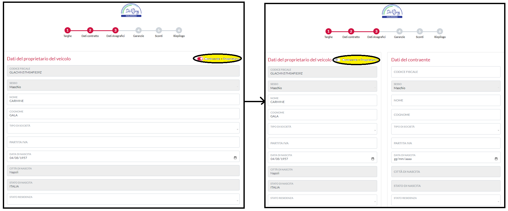
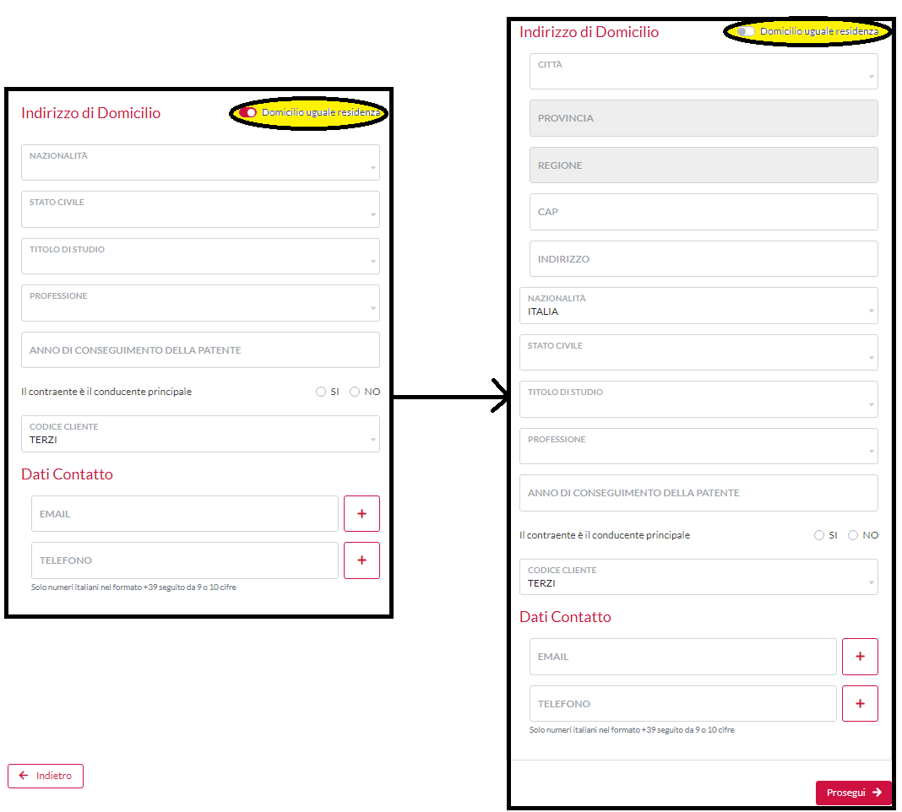
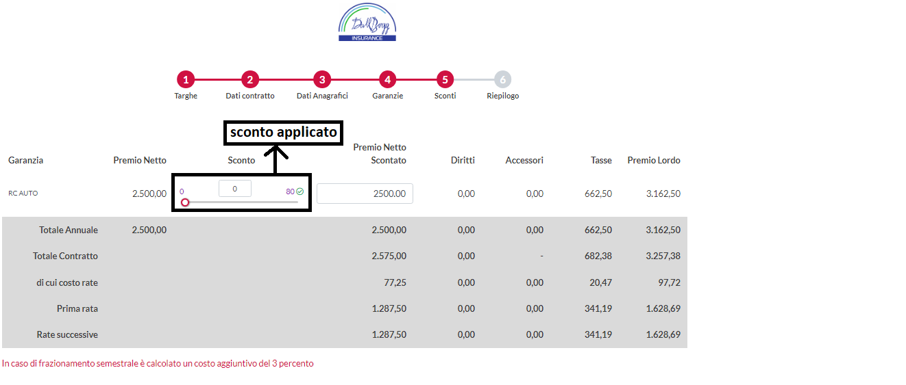
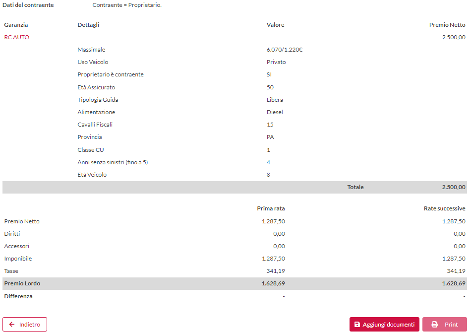

# Preventivi

### 1. Definizione

cos'è il preventivo ? il preventivo è un offerta contrattuale dove vengo riportati i dati dall'assicurato, le garanzie assicurate e il premio da pagare.

### 2. Come creare un  preventivo

Sul portale **Lookinglass** vi sono due modi diversi per creare un preventivo:

* La prima è quella di  di accedere all'emissione polizza tramite la pagina **Main** selezionando **Applicazioni** e successivamente cliccare su Preventivi Dallbogg.

<figure><figcaption></figcaption></figure>

* La seconda modalità è quella di andare su **Dashboard,** selezionare Emissione Polizza che si trova all'interno del menu.

<figure><figcaption></figcaption></figure>

### 3. Stesura preventivo&#x20;

Il preventivo è composto da 6 pannellii:&#x20;

1. Targhe,
2. Dati contratto,
3. Dati Anagrafici,
4. Garanzie,&#x20;
5. Sconti ,
6. Riepilogo.&#x20;

#### 3.1 Targhe&#x20;

In Targhe possiamo trovare tutti i campi da compilare relativi alla targa da assicurare.

<figure><figcaption></figcaption></figure>

In Targhe troviamo tutti i campi da compilare correlati direttamente alle targhe.\
Il primo campo da compilare è Targhe polizza, per prima cosa bisogna inserire l'opzione proprietà tra quelle presenti nella tendina a scorrimento, che sono: \
\- Già proprietario, per già proprietario si intende che il cliente ha già maturato un attestato e che sta assicurando il veicolo per un rinnovo\
\- Prima immatricolazione, per prima immatricolazione si intende una macchina che non è mai stata assicurata, per intenderci una macchina appena uscita da concessionaria nuova di zecca.\
\- Voltura PRA, per voltura al PRA si intende l'acquisto di un veicolo usato, dove il passaggio di proprietà tra il vecchio proprietario ed il nuovo è avvenuto presso un'agenzia avvenuta\
\- Sostituzione targa, si ha necessità di una sostituzione targa quando il proprietario di un veicolo smarrisce o perdere la vecchia targa assicurata e deve recuperare la polizza sulla targa sulla nuova\
\- Auto Epoca, in Auto Epoca rientrano tutte quelle vetture che sono state costruite almeno 20 anni fa.\
\- Solo CVT, è un opzione dedicata soltanto all'autovetture, le CVT sono coperture facoltative complementari a tutela del veicolo che consentono una protezione molto elevata del proprio veicolo.\
Infine andremo ad inserire la targa del veicolo che si vorrà assicurare (in caso di dubbi su come scrivere la targa correttamente vi basterà andare sul punto di domanda grigio che vi illustrerà la corretta nomenclatura), fatto ciò tutti i campi in grigio, ma anche il campo del CF, si compileranno in automatico coi dati presi da ANIA.&#x20;

Il secondo campo è il Codice Fiscale (CF), il codice fiscale viene caricato in automatico da ANIA, più precisamente da SIVI, in caso il CF caricato non sia quello potrete modificarlo manualmente.\
N.B.: Non modificate il C.F. se non avete i documenti opportuni per poter dimostrare l'inesattezza dei dati presi da ANIA, i documenti necessari per tale modifica sono elencati all'interno del punto di domanda alla fine della voce Codice Fiscale del Proprietario veicolo.

IL terzo campo è Targa Attestato di Rischio, se diversa, anche qui sono presenti due caselle la prima è a scorrimento dove troviamo tutte l'Opzione\_ATR, che sono:\
\- Recupero ATR veicolo demolito, il Recupero ATR da veicolo demolito viene utilizzato quando il cliente vuole recuperare l'ATR da un suo veicolo demolito per metterlo sulla nuova auto che si vuole assicurare,\
\- Recupero ATR veicolo venduto, il Recupero ATR da veicolo venduto viene utilizzato quando il cliente vuole recuperare l'ATR da un suo veicolo venduto per metterlo sulla nuova auto che si vuole assicurare,\
\- Recupero ATR veicolo rubato, il Recupero ATR da veicolo rubato viene utilizzato quando il cliente vuole recuperare l'ATR da un suo veicolo rubato per metterlo sulla nuova auto che si vuole assicurare,\
\- Recupero ATR da familiare, il Recupero ATR da familiare viene utilizzato quando il cliente  vuole recuperare l'ATR dal coniuge per metterlo sulla nuova auto che si vuole assicurare, \
\- Recupero ATR da decesso, il Recupero ATR da decesso viene utilizzato quando il cliente  vuole recuperare l'ATR da decesso per metterlo sulla nuova auto che si vuole assicurare,\
N.B.: per poter recuperare l'ATR è necessario che la polizza presente sia terminata.\
\- Bersani stesso proprietario, la Bersani stesso proprietario si effettua quando il proprietario di un veicolo vuole passare la classe di merito ad un'altra sua auto di proprietà.\
-Bersani famiglia, la Bersani famigliare permette il recupero della classe di merito da un famigliare convivente, ad esempio:\
Giovanni ha una classe di merito 1 ed ha un figlio di nome Marco. Marco ha appena acquistato un auto e la vuole assicurare, invece di iniziare con la classe di merito 14 (come ogni nuovo veicolo) prenderà la classe di merito del padre, cioè 1.

Infine passiamo ai dati tecnici dell'auto, qui possiamo fare due distinzioni principali, la prima sono i campi in grigio, mentre i secondi sono quelli in bianchi.\
I campi in grigio sono i campi presi direttamente dal sito di ANIA, non modificabili, mentre quelli in bianco sono i campi che si dovranno compilare manualmente con il libretto di circolazione sotto mano.

#### 3.2 Dati contratto

In Dati contratti vi sono i campi legati alla date di inizio e fine contratto, modalità di pagamento, intermediario ed agenzia che hanno erogato la polizza, infine possiamo trovare il vincolo che è il prestito che l'intermediario eroga al cliente attraverso la sua agenzia.

<figure><figcaption></figcaption></figure>

Dopo aver selezionato la data di decorrenza e l'ora, si genererà automatico la data scadenza, che è il giorno in cui la polizza scade. \
In base al frazionamento scelto, semestrale o annuale, cambia anche la data della scadenza rata, da 12  a 6 mesi di distanza dalla data di decorrenza.

####

<figure><figcaption></figcaption></figure>

####

<figure><figcaption></figcaption></figure>

#### 3.3 Dati anagrafici

Nello step 3 possiamo trovare la pagina dei Dati anagrafici, questo significa che i campi dovranno essere compilati con i dati anagrafici del cliente in presenza di documenti di validi ed aggiornati.\
La pagina è suddivisa in 3 macro aree, la prima dati del proprietario del veicolo, dove vanno i dati presenti sulla Carta D'Identità,  mentre la Partita IVA si può trovare sul sito dell'Agenzia dell'entrate&#x20;

<figure><figcaption></figcaption></figure>

La seconda è Indirizzo di Resitendenza, per poter compilare questa sezione vi basterà il certificato di residenza rilasciato dal comune oppure potete scaricarlo online tramite la pagina ANPR ([https://www.anagrafenazionale.interno.it/servizi-anagrafici/certificati/](https://www.anagrafenazionale.interno.it/servizi-anagrafici/certificati/)).

<figure><figcaption></figcaption></figure>

La terza è Indirizzo di Domicilio, i documenti necessari alla compilazione di questo documento sono: Carta D'Identità, stato civile. \
prima di proseguire ai dati di contatto bisogna sempre chiedere al contraente se è lui il conducente principale, così da poter digitare la corretta casella.

Infine si inseriscono con i dati di contatti del cliente per poter essere contattato.

<figure><figcaption></figcaption></figure>

Prima di poter iniziare a compilare i campi richiesti dalla pagina bisogna sapere se il  contraente della polizza è uguale a il proprietario dell'auto, in caso non fosse così ci toccherà cliccare sulla leva Contraente=Proprietario, apparirà una lista parallela all'originale che dovrà essere compilata con i dati del contraente nella stessa modalità del dati del proprietà veicolo.

<figure><figcaption></figcaption></figure>

In caso il domicilio non sia uguale alla residenza bisognerà cliccare la levetta Domicilio uguale residenza, così facendo appariranno 4 nuove caselle che dovranno essere compilati.

<figure><figcaption></figcaption></figure>

#### 3.4 Garanzie&#x20;

In Garanzie troviamo tutti i servizi di tutela che possono essere erogati ai veicoli d'assicurare.\
In Garanzie troviamo i vari prodotto: \
\- RC Auto\
\- RC Auto Epoca\
\- RC Moto\
\- RC Motocicli\
\- RC Ciclomotori\
\- RC Track\
\- RC Van\
\- RC Rimorchi

<figure><figcaption></figcaption></figure>

Al interno dei prodotti troveremo tutte le garanzie del caso, che sono:\
\- Furto incendio,\
\- Assistenze di vario genere,\
\- Infortunio conducente,\
\- Pacchetto eventi e cristalli ,\
\- KasKo,\
\- Cash back,\
\- Collisione.

#### 3.5 Sconti

In sconti è presente una tabella , composta da 8 colonne.

<figure><figcaption></figcaption></figure>

Nella prima colonna troviamo le voci delle garanzie richieste.

Nella seconda colonna troviamo il primo netto senza sconto.

Nella terza colonna troviamo lo sconto da applicare in base alla situazione del cliente ed agli accordi presi tra intermediario ed IPA.\
Sempre all'interno di Sconto possiamo trovare un cerchio verde affianco al massimale di sconto applicabile,  questo cerchio ci indica se il cliente possa o meno ricevere lo sconto, in caso fosse rosso con una croce interna significa che il cliente non ha tutti i parametri necessari per poter ottenere lo sconto, se ci si cliccherà sopra ci dira il perché non possa ottenere lo sconto.&#x20;

Nella quarta colonna troviamo il risultante dall'applicazione dello sconto al premio netto.

In quinta colonna troviamo i Diritti  che sono un importo fisso aggiunto al premio netto

Nella sesta colonna troviamo Accessori, gli accessori sono un importo variabile composto dai prodotti assicurativi scelti in polizza.

In settima colonna sono presenti le Tasse da imporre sul netto, tra cui l'SSN.&#x20;

In fine in ottava colonna è presente il premio lordo che è ciò che il cliente dovrà pagare nell'anno&#x20;

Si ricorda che in caso di pagamento semestrale si aggiunge un 3% automatico al totale ed in display apparirà il frazionamento in due rate.

N.B: se si vuole cambiare lo sconto applicato bisogna sempre ricordarsi di applicare lo sconto nuovo ed aggiornare la pagina così da vedere il premio netto scontato aggiornato e di conseguenza il premio lordo.

#### 3.6 Riepilogo&#x20;

In riepilogo si ha la possibilità di revisionare tutti i campi compilati nei 5 steps precedenti, in caso si sia compilato qualcosa in modo sbagliato basterà ritornare indietro nel capitolo interessato per apportare la modifica desiderata.&#x20;

<figure><figcaption></figcaption></figure>

###

<figure><figcaption></figcaption></figure>

Una volta terminata la revisione, si potrà proseguire aggiungendo i documenti necessari richiesti dal portale, come il libretto di circolazione e un documento identificativo, oltre ai documenti richiesti vanno anche inseriti la documentazione aggiuntiva richieste dalle operazioni effettuate, esempio:\
Per una Bersani famiglia o per un recupero ATR da familiare si necessiterà dell'attestato di famiglia.\
Una volta terminato l'insermento dei documenti si ha la possibilità di stampare il preventivo da far visionare al cliente così che possa accettare o meno il preventivo, in caso accetti il preventivo si procede all'emissione della polizza.&#x20;

#### 3.7 questionario

<figure><figcaption></figcaption></figure>

Prima di poter emettere la polizza bisognerà compilare un questionario a risposte multiple assieme al contraente.\
Stamparlo, firmarlo e ricaricarlo sul portale, insieme al consenso privacy ed infine emettere la polizza.

<figure><figcaption></figcaption></figure>

Una volta emessa la polizza abbiamo la possibilità di visionare tutto ciò che è stato fatto sulla polizza ed i documenti corelati ad essa. \
In basso a destra si ha la possibilità di stampare la polizza, oppure visionare la polizza in Polizze o in Titoli.\
N.B.: Si ricorda che entro 60 giorni dall'emissione della polizza bisogna inviare il simplo di polizza firmato ovvero la pagina delle dichiarazioni del contraente, al seguente indirizzo email: simplifirmati@adllbogg.it

### Firma digitale

Se il ruolo dispone del premesso **"Abilita documentazione aggiuntiva"** attiva, saranno visibili anche i seguenti campi:

* **Lettera incarico**
* **Dichiarazione di Appropriatezza**
* **Modulo privacy broker**
* **Ricevuta documenti**

È possibile firmare una parte dei documenti e completare la firma degli altri in un secondo momento. Per farlo:

1. Seleziona i documenti desiderati.
2. Premi il pulsante **"Inizia sessione di firma"**.

<figure><figcaption></figcaption></figure>

Se si desidera avviare una nuova sessione di firma per completare i documenti rimanenti:

1. Elimina la sessione di firma precedente.
2. Seleziona i documenti ancora da firmare.
3. Avvia una nuova sessione premendo nuovamente **"Inizia sessione di firma"**.

<figure><figcaption></figcaption></figure>

### 4. Come modificare un preventivo

Prima di modificare un preventivo si deve capire cosa si dovrà modificare, se un preventivo incompleto oppure uno emesso.&#x20;

#### 4.1 Preventivo incompleto

Per Preventivo incompleto si intende un preventivo a cui non sono stati compilati tutti i campi, ma ha almeno raggiunto il secondo punto.

Modificare un preventivo incompleto è relativamente facile, basterà andare su **Quotazioni** utilizzare il filtro a disposizione per ricercare il preventivo ed infine cliccare su l'immagine **Edit**.

<figure><figcaption></figcaption></figure>

#### 4.2 Preventivo emesso

Per preventivo emesso si intende un preventivo che ha terminato tutti i passaggi ed stato cliccato il tasto emetti.

Modificare un preventivo emesso è simile a modificare un preventivo incompleto, con la differenza che al posto di cliccare **Edit** si dovrà selezionare **Duplica**, che andrà a sostituire il preventivo emesso.

<figure><figcaption></figcaption></figure>
