# Quotazioni CVT

## Cos’è la CVT?

La CVT (Corpi Veicoli Terrestri) assicura i veicoli commerciali. Una quotazione può coprire un veicolo o più veicoli della stessa azienda.

### Cosa puoi fare su Lookinglass

* Aggiungere un veicolo o importare una flotta da Excel.
* Scegliere le garanzie per ciascun veicolo.
* Caricare il questionario firmato e i documenti di supporto.
* Richiedere l’approvazione IPA ed emettere la polizza.
* Modificare garanzie e veicoli.
* Annullare la polizza entro 30 giorni dalla data di emissione.

Puoi creare un preventivo CVT su Lookinglass seguendo questi 8 semplici passaggi.



### Avvia una nuova quotazione

1. Apri ACCLR dal menu principale.
2. Seleziona **CVT Nuova quotazione**.

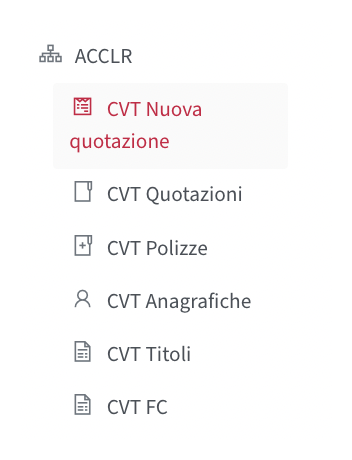



### Aggiungi i veicoli

Scarica prima i documenti precontrattuali:

* Seleziona **Stampa questionario** per scaricare il questionario CVT.
* Seleziona **Set informativo** per scaricare il set informativo.

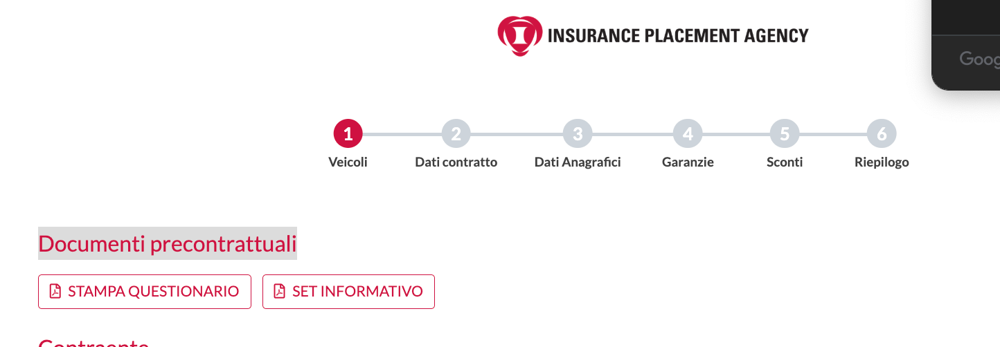

#### Aggiungi un veicolo

1. Seleziona **Aggiungi veicolo**.
2. Inserisci targa, marca, modello, anno, valore assicurato e chilometri.
3. Completa i dati su ricovero, satellitare, leasing e sinistri.
4. Seleziona le garanzie facoltative.
5. Seleziona **Conferma**.


**Importante:** Furto / Incendio / Rapina è obbligatoria, già selezionata e non rimovibile.


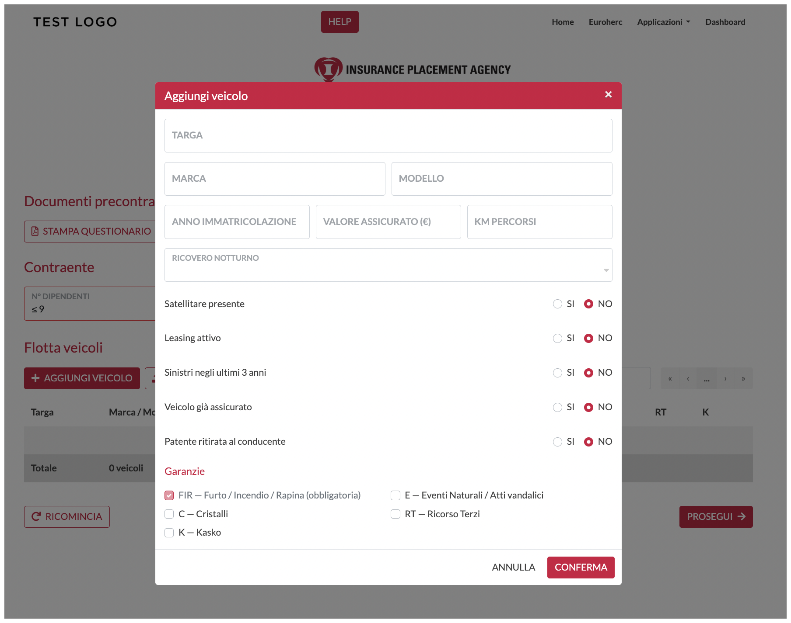

#### Importa una flotta

1. Seleziona **Scarica template import**.
2. Compila una riga per ogni veicolo.
3. Seleziona **Importa flotta** e carica il file compilato.
4. Controlla i veicoli importati nella tabella.
5. Se l’importazione non riesce, correggi riga e colonna indicate nell’errore e ricarica il file.


**Nota:** Nel modello, le colonne con intestazioni in grassetto sono obbligatorie.


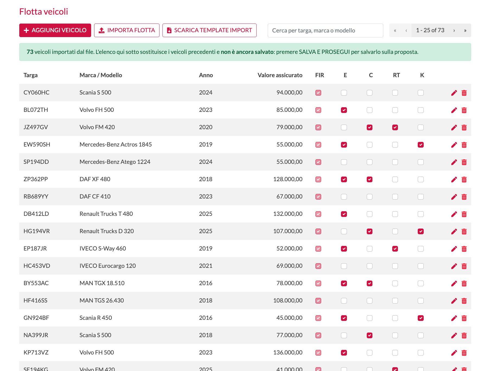



### Inserisci i dati del contratto

1. Seleziona la data di decorrenza.
2. La scadenza è calcolata automaticamente un anno dopo.
3. Scegli il frazionamento: annuale, semestrale, trimestrale o quadrimestrale.
4. Usa il riquadro **Note** per inserire annotazioni visibili anche a IPA.


**Frequenza di pagamento:** Annuale e semestrale non hanno costi aggiuntivi. Trimestrale e quadrimestrale prevedono una maggiorazione del 3%.


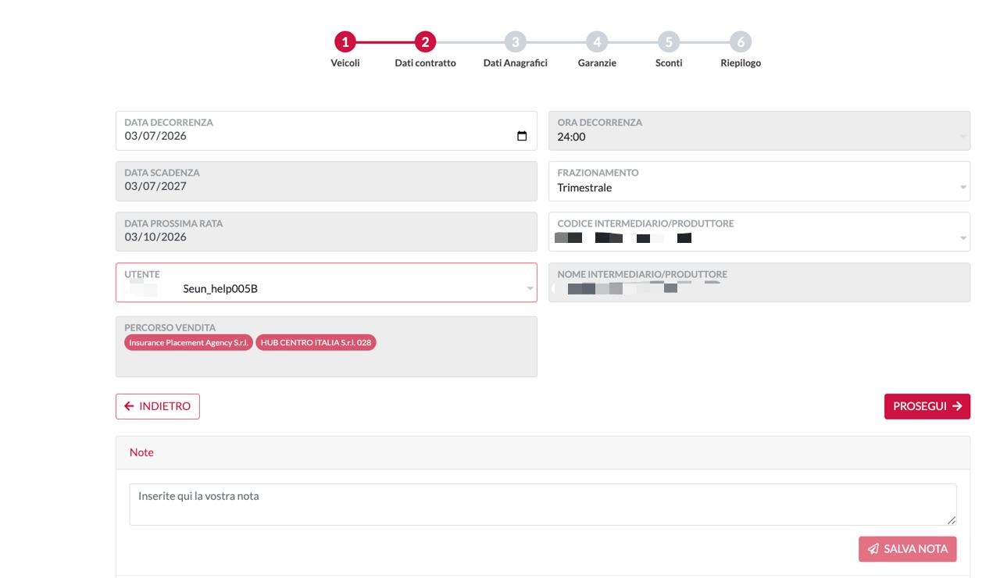



### Inserisci i dati del cliente

1. Inserisci i dati societari del cliente.
2. Partita IVA e Tipo di società sono obbligatori.
3. Completa sede legale e contatti.
4. Seleziona **Aggiungi proprietario** per aggiungere un altro contraente.


**Cliente e proprietario:** La quotazione può contenere il cliente e un solo contraente distinto.


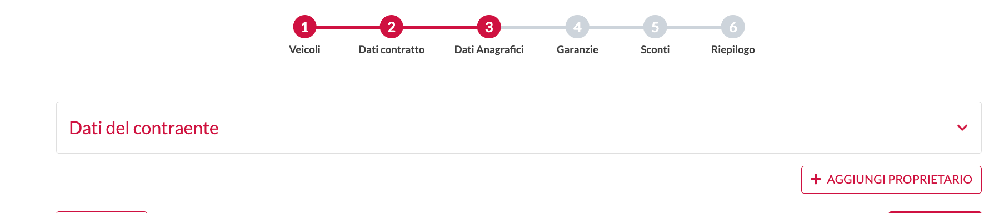



### Verifica le garanzie

Verifica che:

* Il numero di veicoli sia corretto.
* Il valore assicurato totale sia corretto.
* Le garanzie corrispondano ai veicoli aggiunti nella Fase 1.

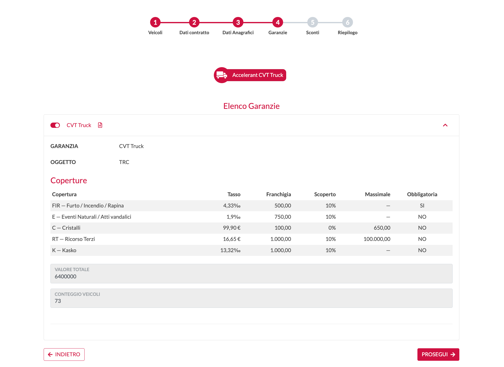



### Controlla premio

1. Controlla il premio totale.
2. Controlla il premio per veicolo.

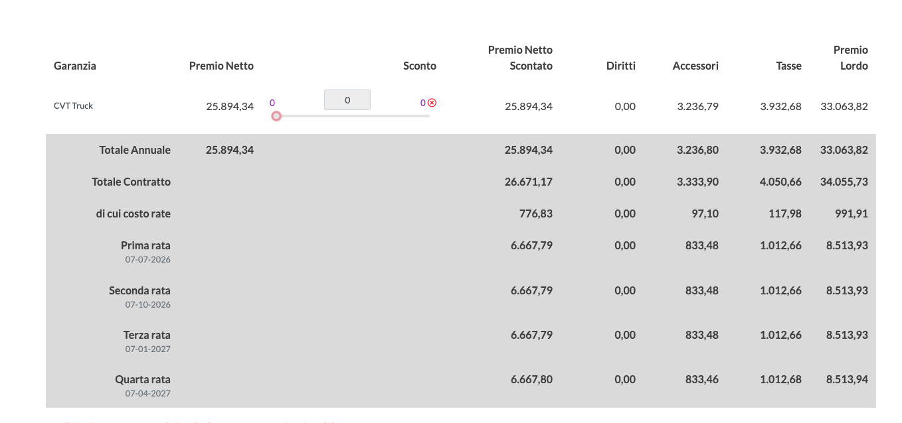



### Rivedi ed emetti la proposta

1. Controlla i dati del cliente.
2. Controlla elenco veicoli e garanzie.
3. Controlla il premio finale.
4. Puoi scaricare elenco veicoli e dettaglio del premio con il pulsante **ESPORTA RIEPILOGO**.
5. Se tutto è corretto, puoi emettere la proposta.

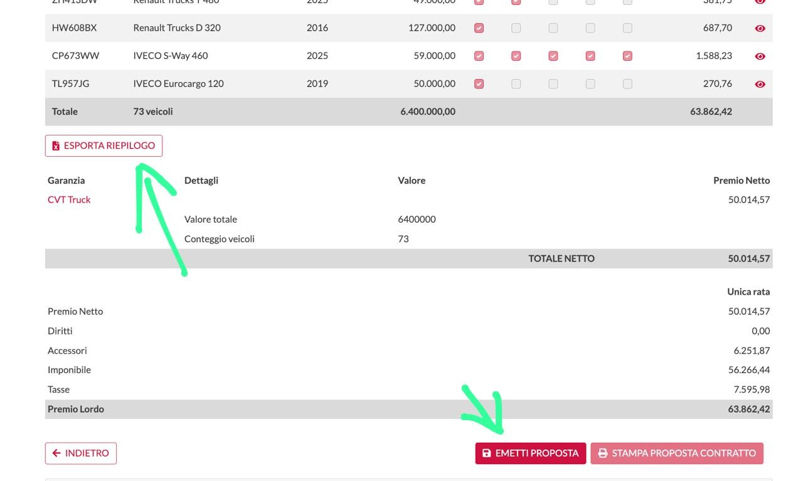



### Emetti la proposta e richiedi l’autorizzazione

1. Nella pagina **Proposta Emessa**, carica il questionario compilato e i documenti.
2. Seleziona le caselle in **Dichiarazione del Contraente** e scegli **Salva**.
3. Seleziona **Richiedi autorizzazione** per inviare la quotazione a IPA.

## Email e stato dopo la richiesta

IPA riceve un’email con richiesta e dettagli. Il broker riceve la conferma dell’invio.

Lo stato passa a **In autorizzazione** e compare in alto.

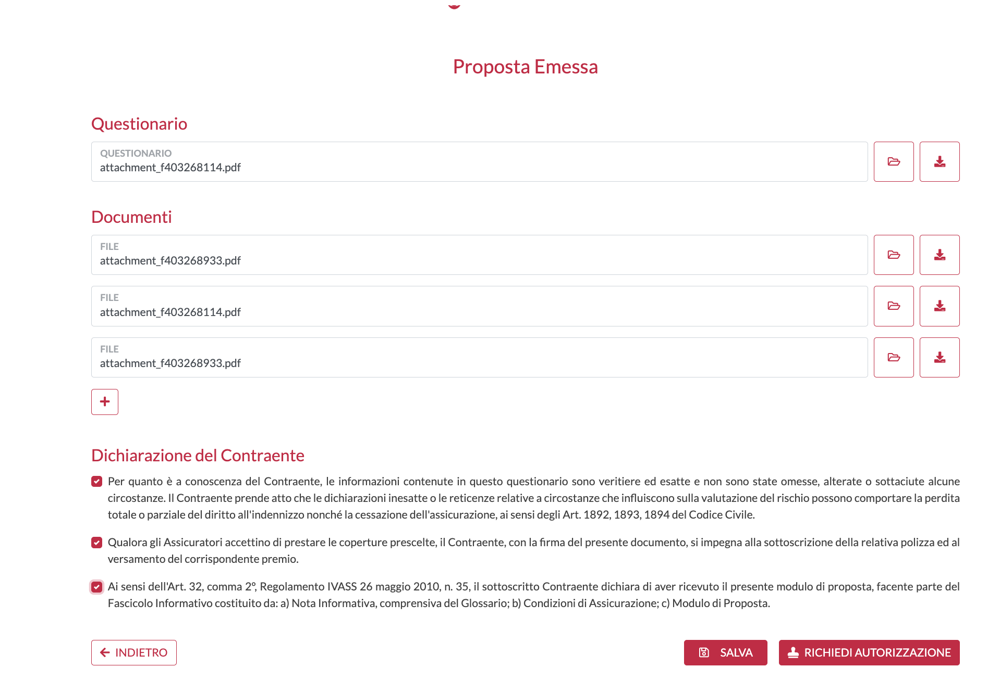

Carica questionario e documenti, conferma le dichiarazioni e seleziona **Richiedi autorizzazione**.

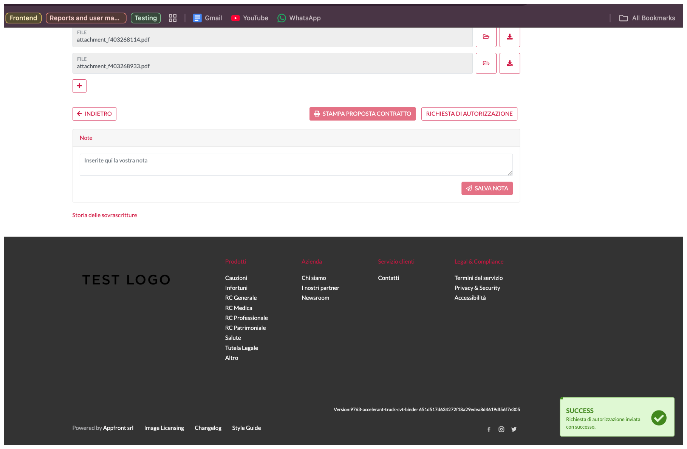

Dopo l’invio corretto della richiesta appare un messaggio di conferma.

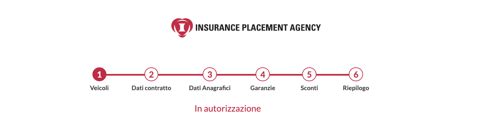

Durante la verifica di IPA, in alto compare lo stato **In autorizzazione**.

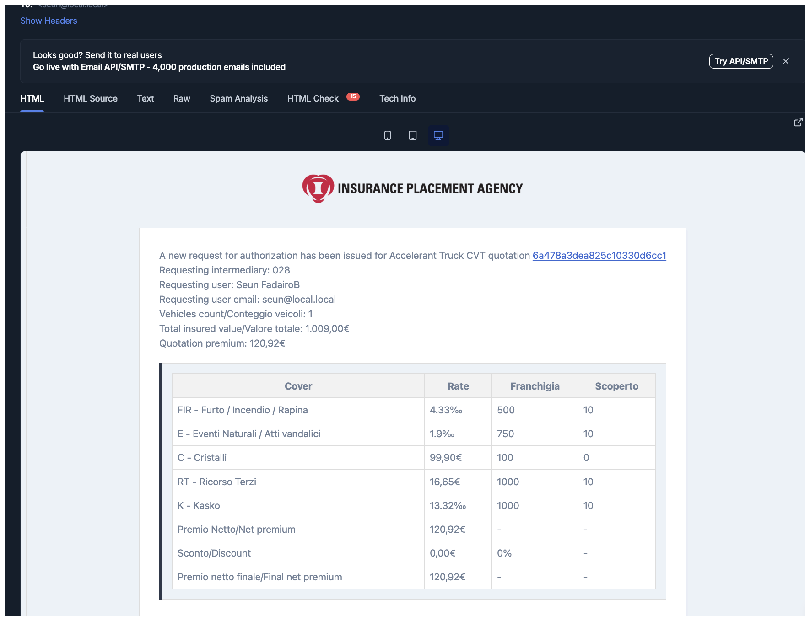

Il broker riceve un’email con i dettagli della richiesta e un link.



## Se IPA richiede una modifica

Prima di approvare la quotazione, IPA può chiederti di correggere alcune informazioni o di caricare un altro documento.



### IPA aggiunge una nota

IPA aggiunge una nota alla quotazione indicando cosa deve essere modificato.



### Ricevi un’email

Ricevi un’email con la nota.



### Correggi la quotazione

Apri la quotazione ed effettua la correzione richiesta oppure carica il documento necessario.



### Salva le modifiche

Salva le modifiche.



### Richiedi nuovamente l’autorizzazione

Seleziona nuovamente **Richiedi autorizzazione** per inviare la quotazione a IPA per una nuova verifica.

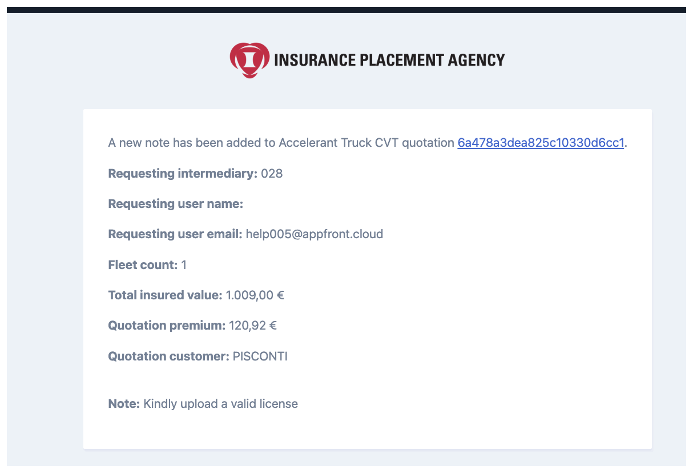

Il broker riceve un’email quando IPA aggiunge una nota.



## Emetti la polizza dopo l’approvazione

Quando IPA approva la quotazione, puoi emettere la polizza.



### Apri la quotazione approvata

Apri la quotazione approvata.



### Verifica i documenti

Verifica questionario firmato e documenti richiesti da IPA.



### Conferma il documento privacy

Conferma che il cliente ha firmato il documento privacy.



### Emetti la polizza

Seleziona **Emetti polizza**.

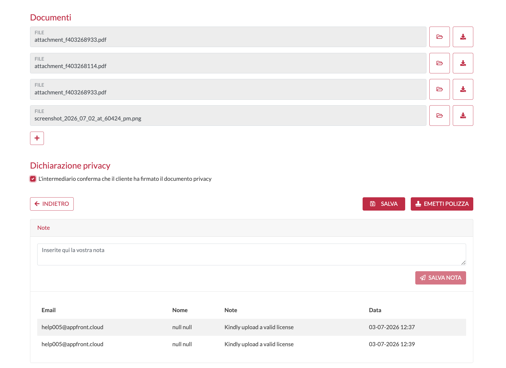

Dopo l’approvazione, conferma la privacy e seleziona **Emetti polizza**.



## Riferimento degli stati della quotazione

| Stato                 | Descrizione                                                        |
| --------------------- | ------------------------------------------------------------------ |
| **PROPOSTA**          | La quotazione è una proposta, ma non è ancora stata inviata a IPA. |
| **IN AUTORIZZAZIONE** | La richiesta è stata inviata ed è in attesa della verifica IPA.    |
| **AUTORIZZATO**       | IPA ha approvato la quotazione. Il broker può emettere la polizza. |
| **RIFIUTATA**         | IPA ha rifiutato la quotazione. Controlla il motivo o la nota.     |
| **POLIZZA**           | La quotazione approvata è stata convertita in polizza.             |
