# CVT Polizze

Dopo che IPA approva la quotazione, il broker può emettere la polizza. Una volta emessa, la polizza viene incassata automaticamente, viene generato il documento di polizza e IPA, il cliente e il broker ricevono l’email della polizza.

## Cosa puoi fare dalla pagina della polizza

* Visualizzare i dettagli della polizza, il premio, le rate, i veicoli, le garanzie e i documenti.
* Scaricare o stampare il PDF della polizza.
* Scaricare l’elenco della flotta veicoli dalla polizza.
* Caricare nuovi documenti di supporto.
* Generare una quietanza quando necessario.
* Aprire il titolo collegato alla polizza.
* Annullare una polizza, se si dispone dell’autorizzazione necessaria.

## Emettere la polizza da una quotazione approvata

Dopo che IPA approva la quotazione, torna alla pagina della quotazione e completa il passaggio finale di emissione della polizza.



### Apri la quotazione approvata



### Verifica questionario e documenti

Verifica che il questionario e i documenti di supporto siano disponibili.



### Conferma la dichiarazione privacy

Seleziona la dichiarazione privacy confermando che il cliente ha firmato il documento privacy.



### Emetti la polizza

Seleziona **Emetti polizza**.



## La polizza viene emessa

Una volta emessa la polizza, Lookinglass mostra il riepilogo finale della quotazione.

Da questa pagina, il broker può continuare verso la polizza o verso il titolo collegato.

* Seleziona **Vai alla polizza** per aprire la pagina della polizza.
* Seleziona **Vai al titolo** per aprire il relativo titolo/record di pagamento.
* Usa **Stampa** per scaricare o stampare i documenti generati.
* Il questionario e i documenti di supporto restano visibili nella sezione **Documenti**.


La polizza non può essere emessa fino a quando la quotazione non è stata approvata da IPA e la dichiarazione privacy non è stata confermata.


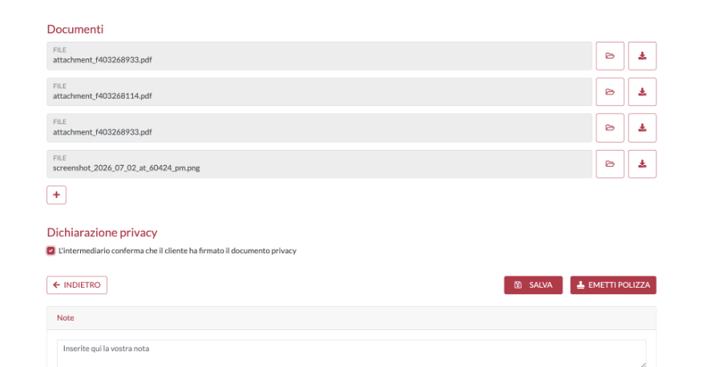

## Lista CVT Polizze

Apri **CVT Polizze** dal menu ACCLR per visualizzare le polizze CVT emesse. La lista può essere cercata e filtrata per trovare rapidamente la polizza corretta.

* I filtri più comuni includono ID, Agenzia, P.IVA, Nome Azienda, Intermediario, Targa, Frazionamento, Data Produzione, Data Decorrenza e Data Termine.
* Le icone delle azioni permettono agli utenti di aprire, stampare o eseguire altre azioni consentite sulla polizza.
* Le azioni disponibili dipendono dal ruolo e dalle autorizzazioni dell’utente.

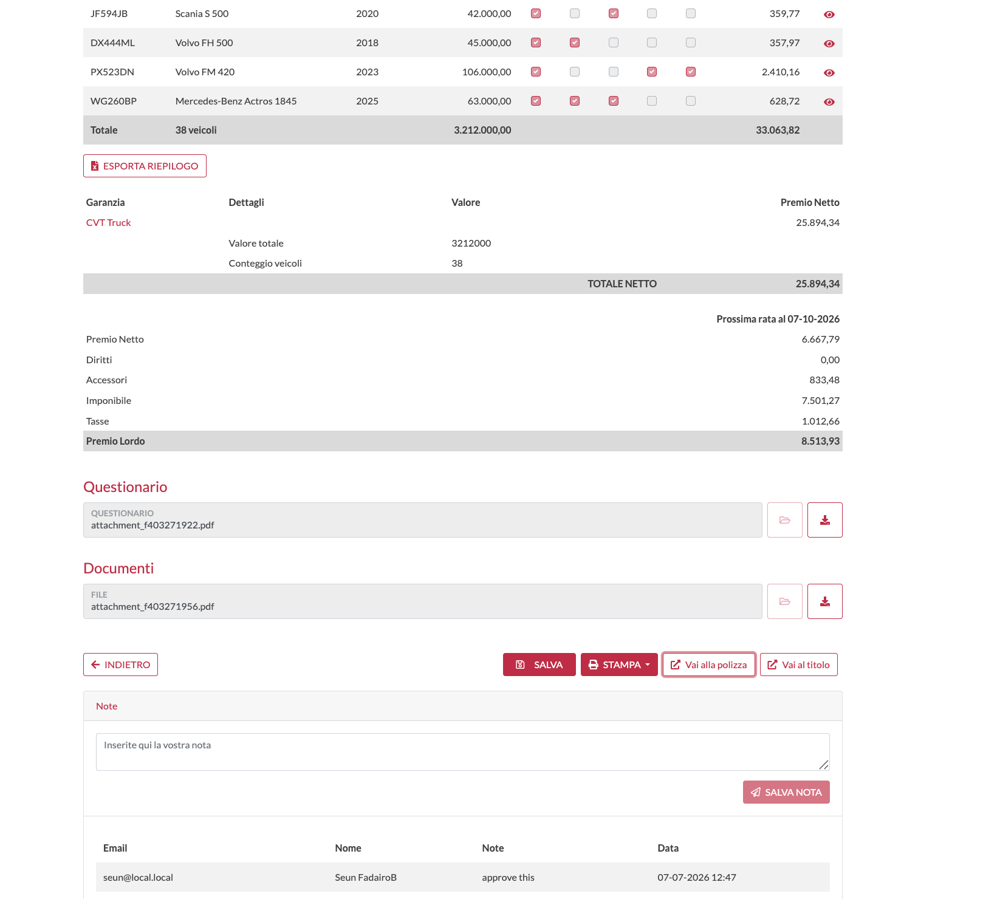

_Riepilogo finale della quotazione dopo l’emissione della polizza, con i pulsanti per aprire la polizza o il titolo._

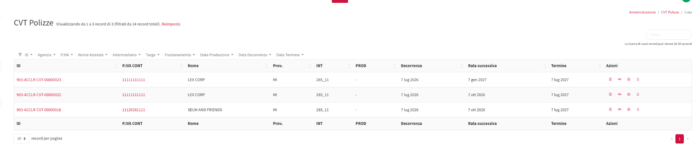

_Lista CVT Polizze con filtri e icone azione della polizza._

## Comprendere la pagina di dettaglio della polizza

La pagina di dettaglio della polizza mostra tutte le informazioni della polizza. Usa questa pagina per controllare dati della polizza, dettagli del premio, veicoli, documenti e azioni disponibili.

| Sezione            | Cosa mostra                                                                                                                                   |
| ------------------ | --------------------------------------------------------------------------------------------------------------------------------------------- |
| Dati della polizza | Numero di polizza, quotazione di origine, prodotto, data di decorrenza, data di termine, rata successiva, data di produzione e frazionamento. |
| Emessa da          | L’utente/azienda che ha emesso la polizza e la data di emissione.                                                                             |
| Anagrafiche        | Il contraente/cliente collegato alla polizza.                                                                                                 |
| Garanzie           | Prodotto CVT, premio netto annuo, premio netto scontato e percentuale di sconto.                                                              |
| Rate               | Lo scadenzario delle rate con date di scadenza, imponibile, tasse e totale.                                                                   |
| Flotta veicoli     | Tutti i veicoli coperti, le garanzie selezionate e le informazioni sul premio.                                                                |
| Documenti          | Questionario, documenti della quotazione, file di supporto caricati e PDF della polizza.                                                      |

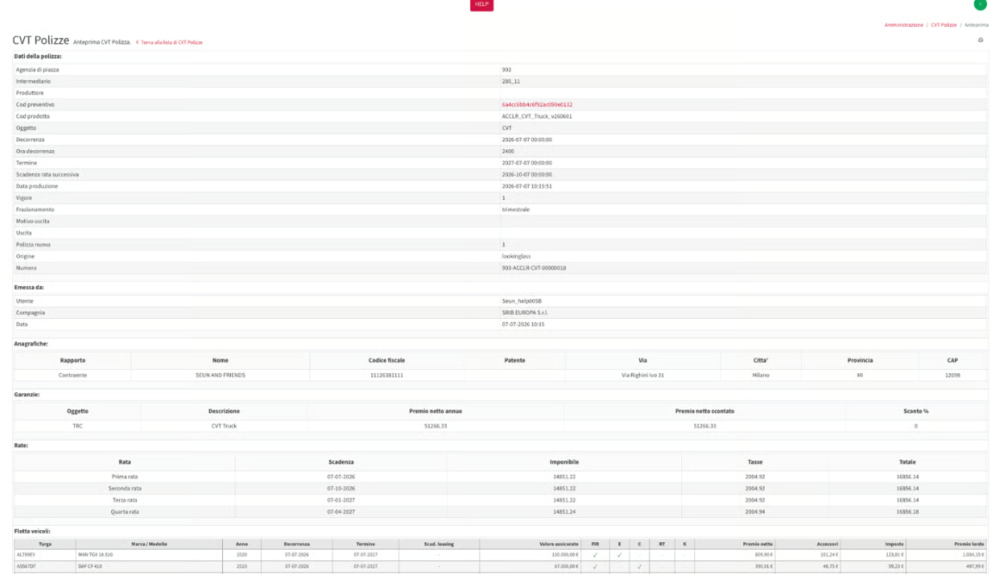

_Pagina di dettaglio della polizza con le sezioni principali e i dati della polizza._

## Dettagli flotta e premio

La tabella della flotta mostra ogni veicolo incluso nella polizza. Mostra anche le garanzie selezionate e i valori di premio per ciascun veicolo.

* Controlla la targa e il modello del veicolo.
* Controlla le date di decorrenza e termine del veicolo.
* Controlla il valore assicurato.
* Controlla le garanzie selezionate: FIR, E, C, RT e K.
* Verifica il premio netto, gli accessori, le tasse e il premio lordo per ciascun veicolo.

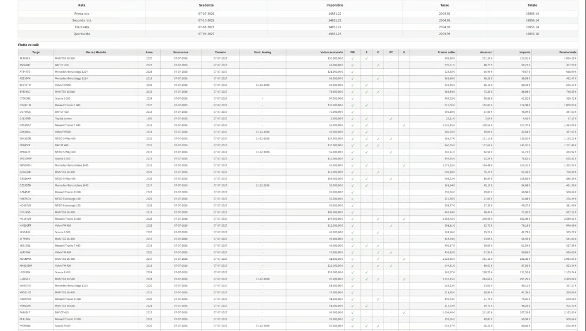

_Tabella della flotta di polizza con veicoli coperti, garanzie e colonne premio._

## Documenti della polizza

I documenti caricati durante la fase di quotazione sono disponibili anche dalla pagina della polizza.

* Il questionario è mostrato qui.
* Sono mostrati i documenti precontrattuali e i file di supporto caricati durante la quotazione.
* Anche il PDF della polizza generato è disponibile nella lista documenti.
* È ancora possibile caricare nuovi documenti dopo l’emissione della polizza usando **Carica documento**.
* Se vengono effettuate regolazioni, anche i documenti di regolazione saranno visualizzati e disponibili per il download in questa sezione.
* Usa i link dei documenti per aprire o scaricare ciascun file.

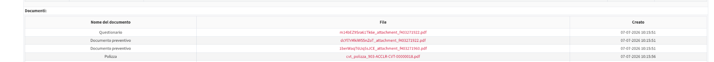

_Tabella documenti della polizza con questionario, documenti precontrattuali e PDF della polizza._

## PDF della polizza e QR code

Il PDF della polizza generato contiene il certificato ufficiale e le informazioni di copertura per il cliente.

* Numero di polizza e informazioni sul prodotto.
* Informazioni del cliente e dell’assicurato.
* Data di decorrenza e data di termine della polizza.
* Dettaglio del premio e scadenzario delle rate.
* Veicoli coperti e garanzie selezionate.
* Un QR code che può essere scansionato per verificare la polizza.


**QR code:** Il QR code apre una pagina pubblica di verifica dove è possibile controllare i dettagli della polizza. Il cliente può usarlo per verificare il numero di polizza, il cliente, il premio, i veicoli coperti e le date.


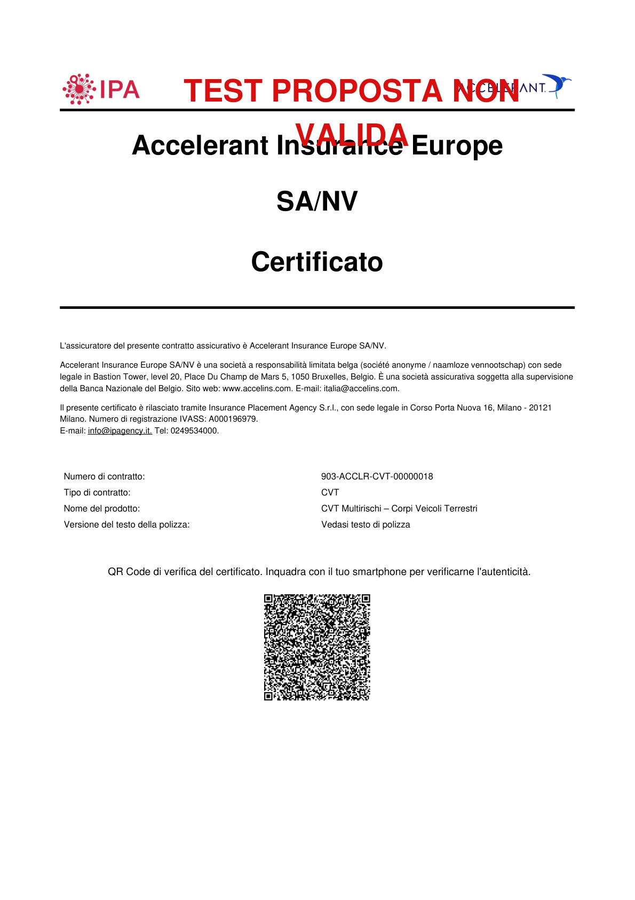

_Esempio della prima pagina del PDF della polizza CVT generata._

## Azioni principali nella pagina di dettaglio della polizza

I pulsanti azione in fondo alla pagina della polizza permettono al broker o all’utente autorizzato di lavorare sulla polizza emessa.

_Pulsanti azione della polizza._

| Pulsante             | Quando usarlo                                                                                                         |
| -------------------- | --------------------------------------------------------------------------------------------------------------------- |
| Cancella             | Avvia il processo di annullamento della polizza, quando consentito dalle autorizzazioni e dalle regole della polizza. |
| Stampa PDF           | Stampa o scarica il PDF della polizza.                                                                                |
| Esporta flotta       | Scarica l’elenco dei veicoli coperti dalla polizza.                                                                   |
| Carica documento     | Carica un nuovo documento sulla polizza dopo l’emissione.                                                             |
| Registra Variazione  | Registra una variazione/modifica sulla polizza quando applicabile.                                                    |
| Genera una quietanza | Genera una ricevuta/record di pagamento per la polizza.                                                               |

## Come annullare una polizza

Una polizza CVT può essere annullata per ripensamento entro 30 giorni dalla data di produzione e ottenere un rimborso totale del 100%. Questa azione è disponibile solo per gli utenti con l’autorizzazione. Se non hai l’autorizzazione, contatta IPA.



Apri la pagina di dettaglio della polizza



Seleziona Cancella



Scegli la motivazione dell’annullamento



Seleziona la data di annullamento



Carica il documento di annullamento: Carica il documento di annullamento e inserisci il nome del documento.



Seleziona l’opzione di calcolo o rimborso: Seleziona l’opzione corretta di calcolo/rimborso quando viene mostrata.



Salva l’annullamento



Incassa il titolo di annullamento: Un titolo di annullamento non viene incassato automaticamente. Puoi aprirlo e incassarlo manualmente.



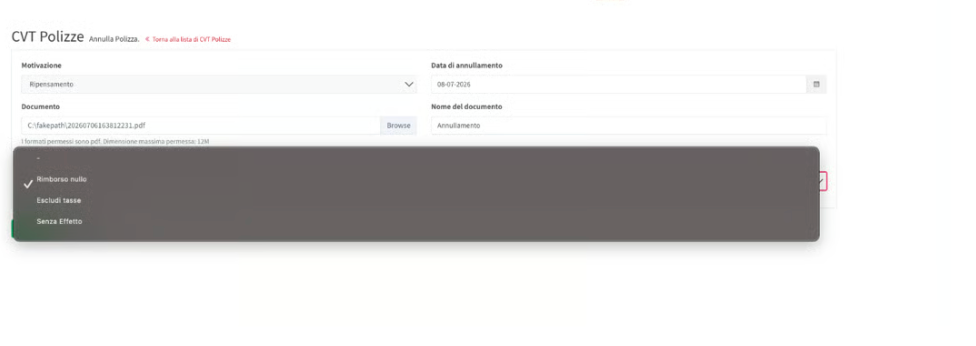

_Pagina di annullamento polizza con motivazione, data di annullamento, caricamento documento e opzioni di calcolo rimborso._

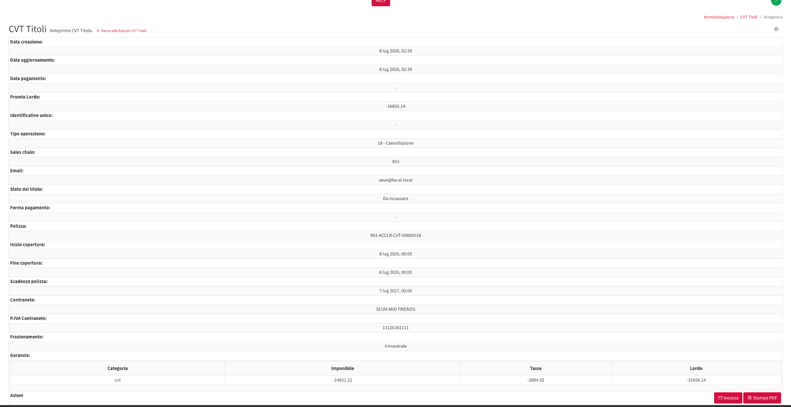

_Pagina titolo CVT che mostra i dettagli di un’operazione di annullamento._

### Per incassare il titolo di annullamento



Seleziona Incassa



Scegli lo stato del titolo e la forma di pagamento



Verifica l’importo del premio lordo



Seleziona Salva



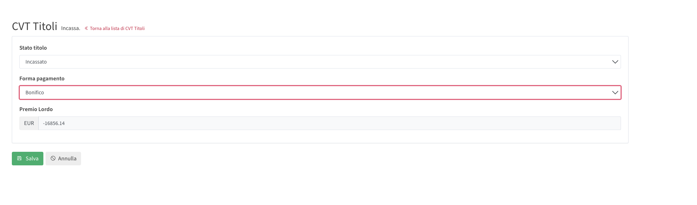

_Pagina Incassa con stato titolo, forma di pagamento e premio lordo._

## Annullamento in giornata

Utilizza l’annullamento in giornata quando una polizza è stata emessa per errore, ad esempio a causa di un’emissione accidentale o di dati errati inseriti durante il processo di emissione.

Questo processo deve essere utilizzato solo quando la polizza deve essere annullata lo stesso giorno in cui è stata emessa. Dopo l’annullamento, sarà possibile emettere una nuova polizza in sostituzione di quella annullata.



Apri la lista CVT Polizze



Trova la polizza che desideri annullare.



Apri i dettagli del titolo: Clicca sull’icona a forma di occhio nella colonna **Azioni** per aprire i dettagli del titolo.



Seleziona Incassa: Nella pagina di anteprima del titolo, clicca su **Incassa** in basso a destra.



Modifica lo stato del titolo: Nel campo **Stato titolo**, modifica lo stato da **Incassato** ad **Annullato**.



Seleziona la forma di pagamento: Nel campo **Forma pagamento**, seleziona **N/A**.



Verifica il Premio Lordo



Clicca su **Salva**.



Dopo il salvataggio, lo stato del titolo viene aggiornato ad **Annullato** e la polizza emessa viene annullata. Si prega di notare che non verrà registrato alcun rimborso nell’ foglio di cassa.

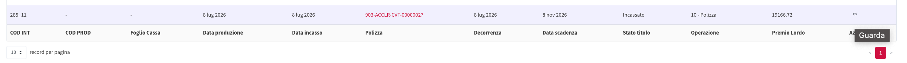

_Lista CVT Titoli con azione “Guarda”._

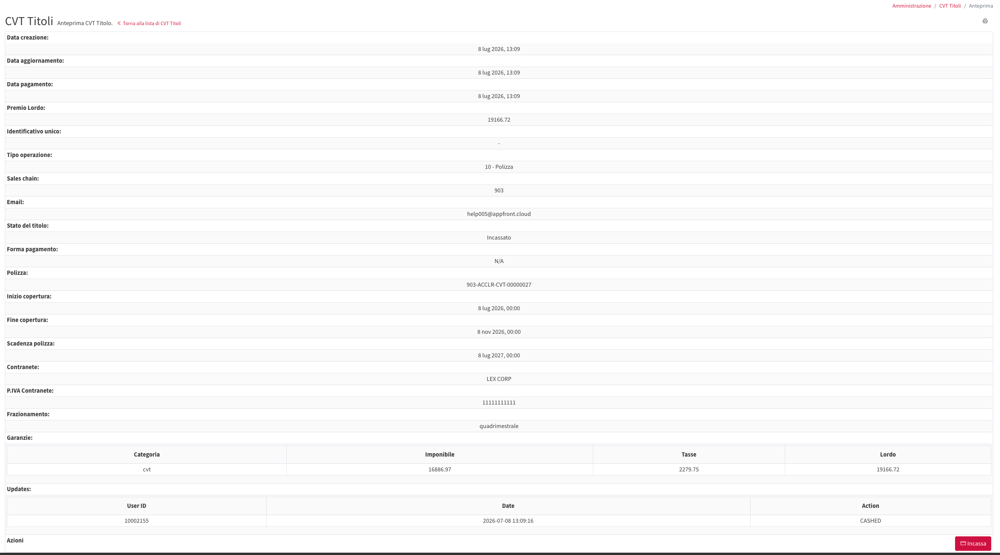

_Anteprima titolo con pulsante “Incassa”._

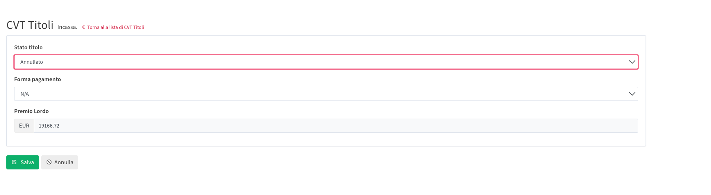

_Pagina Incassa per annullare il titolo._
