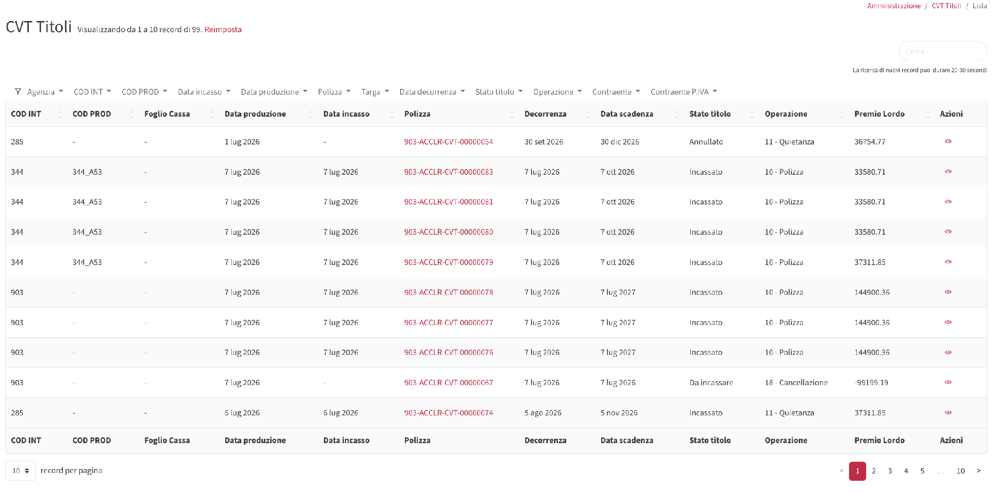
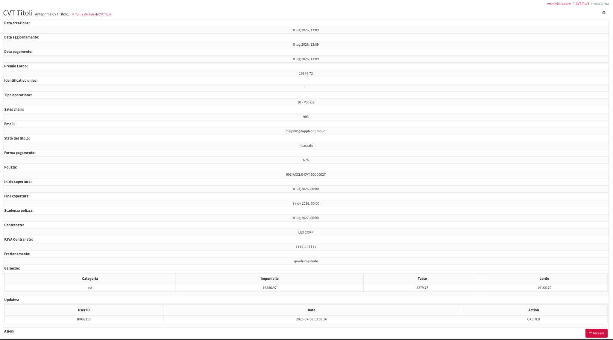
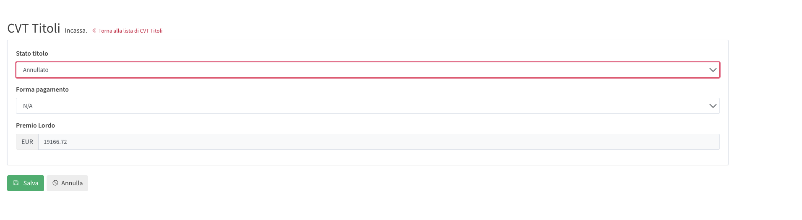
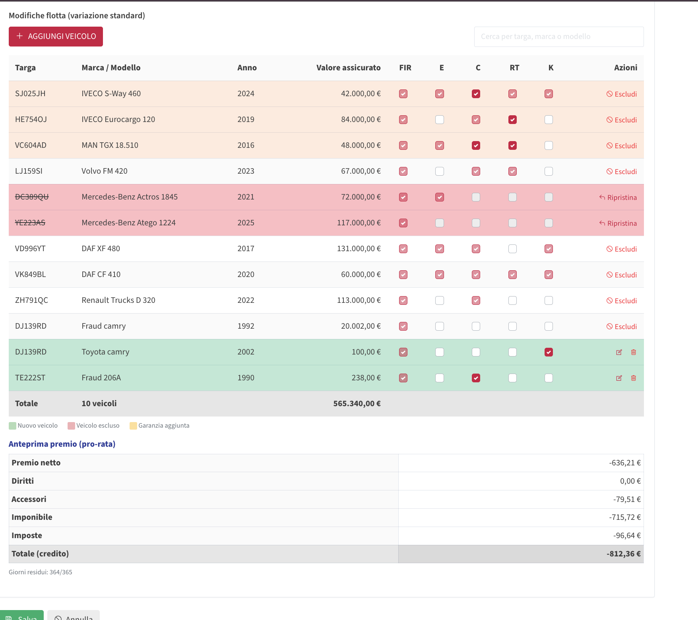
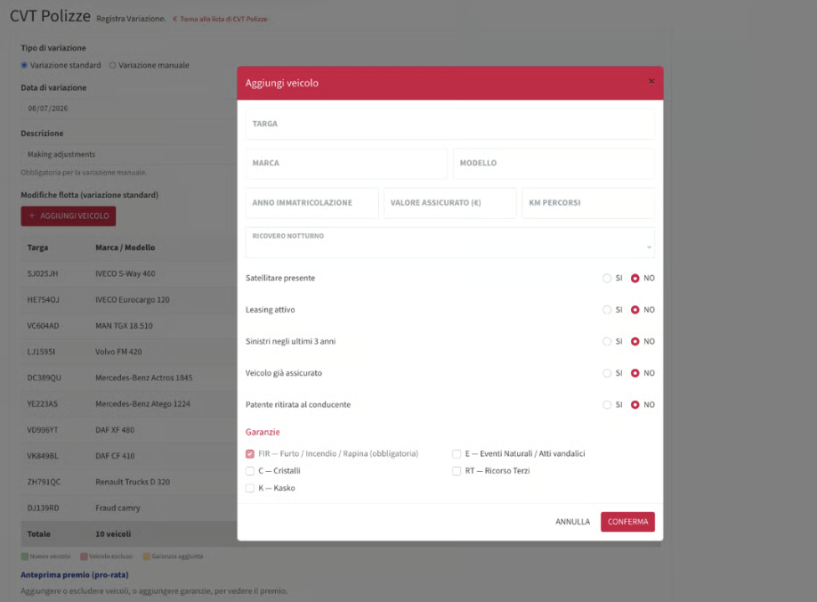
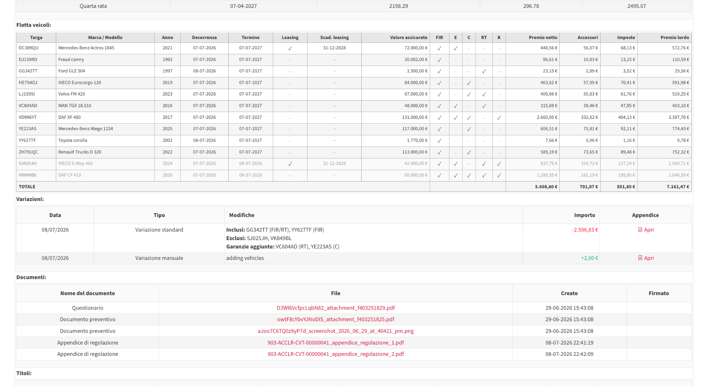

# CVT Titoli, Variazioni & Quietanza

Dopo l'emissione della polizza CVT, il numero di polizza rimane il riferimento principale del contratto. Le attività post-vendita, come variazioni, quietanze e incassi, sono gestite dalla pagina della polizza e dalla pagina CVT Titoli.

## Pagina CVT Titoli

_Lista CVT Titoli con azione Guarda._

La pagina CVT Titoli mostra le registrazioni contabili e di pagamento collegate alle polizze CVT. Un titolo può rappresentare un'emissione di polizza, una quietanza, una variazione, un'operazione di cancellazione o un'altra operazione collegata al pagamento.

Da questa pagina, l'utente può cercare un titolo di polizza, controllare lo stato del titolo, verificare l'importo del premio e aprire i dettagli del titolo, oltre a modificare lo stato di incasso usando l'icona a forma di occhio nella colonna Azioni.

* **Polizza:** il numero di polizza collegato al titolo.
* **Decorrenza / Data scadenza:** il periodo di copertura o di pagamento collegato al titolo.
* **Stato titolo:** lo stato contabile/di pagamento attuale.
* **Operazione:** il tipo di operazione, ad esempio polizza, quietanza, variazione o fine contratto.
* **Premio Lordo:** l'importo lordo registrato per il titolo.
* **Azioni:** le azioni disponibili, inclusa l'apertura dell'anteprima del titolo.

## Anteprima titolo

Anteprima titolo con dettagli di polizza, pagamento e premio.

La pagina di anteprima del titolo mostra tutti i dettagli del titolo selezionato. Include la data di creazione, la data di pagamento, il numero di polizza, il contraente, la partita IVA, il frazionamento, lo stato del titolo e il riepilogo del premio.

Quando il titolo può essere aggiornato, il pulsante **Incassa** viene mostrato in basso a destra nella pagina.

## Incasso di un titolo

La pagina Incassa viene usata per aggiornare lo stato del titolo e la forma di pagamento.

Usa Incassa quando un titolo o una quietanza deve essere aggiornato con lo stato del pagamento e la forma di pagamento.



Apri la lista CVT Titoli



Trova il titolo collegato alla polizza



Clicca sull'icona a forma di occhio sotto Azioni



Clicca **Incassa** in basso a destra nella pagina di anteprima del titolo.



Seleziona lo Stato titolo corretto



Seleziona la Forma pagamento corretta



Verifica l'importo del Premio Lordo



Clicca Salva



Dopo il salvataggio, il titolo viene aggiornato con lo stato e la forma di pagamento selezionati.

## Variazioni

_Pagina variazione con opzioni di variazione standard e manuale._

Una variazione viene utilizzata quando una polizza CVT già emessa deve essere modificata senza creare un nuovo numero di polizza. La variazione viene registrata sulla polizza esistente ed è visibile dalla pagina di dettaglio della polizza e dai documenti.

Le variazioni vengono utilizzate per aggiornare la flotta o la configurazione delle garanzie dopo l'emissione della polizza. L'impatto sul premio viene calcolato pro-rata utilizzando i giorni residui del periodo di polizza.

### Cosa può essere modificato

* Aggiungere un nuovo veicolo alla polizza.
*   Rimuovere un veicolo dalla polizza quando l'utente dispone dei permessi richiesti.

    Per gli utenti broker, la rimozione del veicolo è gestita da IPA.
* Aggiungere nuove garanzie ai veicoli già presenti in polizza.
* Registrare una variazione manuale con descrizione e importo quando necessario.

### Regole delle variazioni

* Il numero di polizza non cambia dopo una variazione.
* Le date originali di decorrenza e termine della polizza non cambiano.
* Le garanzie già selezionate non possono essere rimosse; possono essere aggiunte solo garanzie aggiuntive.
* Ogni variazione viene calcolata pro-rata in base al periodo di copertura residuo.
* Ogni variazione viene mostrata cronologicamente nella pagina della polizza.
* Una variazione non può essere annullata direttamente. Per correggere una variazione precedente, deve essere registrata una nuova variazione.
* Il documento di variazione viene generato dopo la variazione e può essere aperto dai documenti della polizza o dalla sezione variazioni.

Quando l'utente seleziona **Aggiungi veicolo**, il modale consente di inserire i dettagli del nuovo veicolo e le garanzie. La garanzia FIR è obbligatoria. Le altre garanzie possono essere selezionate quando applicabili.

### Aggiunta di un veicolo durante una variazione



Clicca Aggiungi veicolo



Inserisci i dati del veicolo: Inserisci targa, marca, modello, anno di immatricolazione, valore assicurato e chilometri del veicolo.



Completa le domande di rischio: Completa le domande di rischio del veicolo, come ricovero notturno, dispositivo satellitare, leasing, sinistri recenti, assicurazione precedente e ritiro della patente al conducente.



Seleziona le garanzie da applicare al veicolo.



Clicca Conferma



_Modale Aggiungi veicolo usato durante una variazione standard._

### Revisione dell'anteprima della variazione

_Modifiche alla flotta e anteprima premio pro-rata._

La tabella della variazione mostra la flotta attuale, i veicoli aggiunti, i veicoli esclusi e le garanzie aggiunte. L'anteprima mostra anche l'impatto del premio pro-rata prima del salvataggio della variazione.

* **Righe verdi:** nuovi veicoli aggiunti tramite la variazione.
* **Righe rosa/rosse:** veicoli esclusi dalla polizza.
* **Righe gialle:** nuove garanzie aggiunte.
* **Garanzie evidenziate:** nuove garanzie aggiunte ai veicoli esistenti.
* **Anteprima premio:** il credito o debito pro-rata generato dalla modifica.
* **Giorni residui:** i giorni di polizza rimanenti usati per il calcolo pro-rata.

### Variazione nella pagina della polizza

Pagina polizza con flotta, variazioni e documenti generati.

Dopo il salvataggio della variazione, la pagina della polizza viene aggiornata. La flotta modificata rimane sotto lo stesso numero di polizza e la variazione viene mostrata nella sezione Variazioni.

La tabella Variazioni mostra la data della variazione, il tipo di variazione, le modifiche effettuate, l'importo e il link al documento di appendice. La sezione Documenti mostra anche i documenti di variazione generati insieme ai documenti di polizza esistenti.

L'anteprima deve essere controllata prima del salvataggio perché mostra l'effetto economico della variazione.

### Documento di variazione

Dopo la registrazione di una variazione, Lookinglass genera un documento di appendice di regolazione. Questo documento funge da ricevuta della variazione e riepiloga la modifica e l'effetto sul premio.

* Numero di polizza.
* Data della variazione.
* Veicoli aggiunti o rimossi.
* Garanzie aggiunte.
* Premio netto, accessori, imponibile, imposte e premio lordo.
* Importo da pagare o da accreditare a causa della variazione.

### Titolo 12 - Titolo di variazione

Le variazioni vengono registrate come **Titolo 12 — Sostituzione**.\
Quando viene registrata una variazione, Lookinglass registra il risultato economico della modifica in un titolo di variazione dedicato.

L’importo della variazione può essere positivo o negativo:

* Un **importo positivo** indica che il cliente deve pagare un importo aggiuntivo.
* Un **importo negativo** indica un effetto di credito/rimborso per il cliente.

La polizza mantiene lo stesso numero di polizza. Le date originali di decorrenza e termine non cambiano, e lo scadenzario normale delle quietanze continua come previsto inizialmente.

Il Titolo 12 viene utilizzato per tracciare l’importo della variazione separatamente dallo scadenzario normale delle rate. Il Titolo 12 può essere incassato in qualsiasi momento durante il periodo di polizza, prima della generazione del Titolo 31 finale. L’utente può quindi incassare subito il titolo di variazione, incassarlo in un secondo momento, oppure lasciarlo da regolare alla fine della polizza.

Se il **Titolo 12 viene incassato**, il suo importo viene considerato già risolto e **non sarà incluso** nel Titolo 31 finale.

Se il **Titolo 12 non viene incassato**, il suo importo rimane pendente e sarà incluso nel **Titolo 31 — Fine contratto**.

Questo significa che le quietanze non vengono ricalcolate quando viene effettuata una variazione. Lo scadenzario di pagamento esistente rimane invariato, mentre le differenze legate alle variazioni vengono gestite separatamente tramite Titolo 12 e, se ancora non risolte, tramite Titolo 31.

Lo storico delle variazioni e i documenti di appendice generati rimangono visibili dalla pagina della polizza.

## Generazione quietanza

Una quietanza è la ricevuta/titolo di pagamento collegata a una rata della polizza. Viene utilizzata per gestire e registrare il pagamento di una rata di polizza.

Normalmente, le quietanze vengono generate automaticamente alle successive date di pagamento definite dal frazionamento della polizza. Per esempio, se una polizza è trimestrale, le quietanze vengono generate secondo lo scadenzario rate trimestrale.

### Generazione automatica della quietanza

* Il frazionamento della polizza definisce lo scadenzario delle rate.
* Lookinglass genera la quietanza successiva in base alla data di pagamento programmata.
* La quietanza generata appare nella sezione CVT Titoli.
* L'utente apre il titolo per controllare l'importo, il periodo di competenza e lo stato del pagamento.
* Il titolo può essere incassato quando deve essere registrato il pagamento.

Le quietanze continuano a seguire lo scadenzario di pagamento della polizza. Le differenze delle variazioni vengono gestite tramite il titolo di variazione/regolazione finale, invece di riscrivere lo scadenzario quietanze esistente.

### Generazione manuale della quietanza

Quando l'azione è disponibile dalla pagina della polizza, l'utente può usare **Genera una quietanza** per creare una nuova quietanza per la polizza.



Apri la lista CVT Polizze



Apri la polizza con l'icona a forma di occhio.



Scorri fino ai pulsanti di azione: Scorri fino ai pulsanti di azione in fondo alla pagina della polizza.



Clicca Genera una quietanza



Controlla il titolo generato da CVT Titoli.



Incassa il titolo se deve essere registrato il pagamento.



## Incasso quietanze

L'incasso di una quietanza segue lo stesso flusso Incassa usato per gli altri titoli CVT.



Apri CVT Titoli



Cerca il numero di polizza o il titolo quietanza



Apri il titolo usando Guarda



Clicca Incassa



Scegli lo Stato titolo corretto



Scegli la Forma pagamento



Verifica il Premio Lordo



Clicca Salva



Dopo il salvataggio, il titolo quietanza viene aggiornato con lo stato e la forma di pagamento selezionati.

### Titolo 31 — Fine contratto

Il **Titolo 31 — Fine contratto** è il titolo di regolazione finale utilizzato per risolvere l’effetto economico residuo delle variazioni effettuate durante il periodo di polizza.

Quando una polizza CVT ha delle variazioni, il numero di polizza rimane invariato e lo scadenzario delle quietanze continua normalmente. Gli importi delle variazioni vengono tracciati separatamente tramite **Titolo 12**.

Alla fine del contratto, il Titolo 31 contiene il totale degli importi delle variazioni che **non sono già stati incassati**.

Se un titolo di variazione è già stato incassato prima della generazione del Titolo 31, quell’importo viene ignorato nel calcolo del Titolo 31 perché è già stato regolato.

Se un titolo di variazione è rimasto non pagato o differito, quell’importo viene incluso nel Titolo 31.

L’importo del Titolo 31 può essere positivo o negativo:

* Un **importo positivo** indica che il cliente deve pagare il saldo residuo delle variazioni.
* Un **importo negativo** indica che il cliente ha un saldo a credito/rimborso.

Il Titolo 31 viene utilizzato per chiudere il saldo delle variazioni alla fine del contratto. Non sostituisce lo scadenzario normale delle quietanze; serve solo a regolare i valori residui delle variazioni che non sono stati incassati durante il periodo di polizza.
